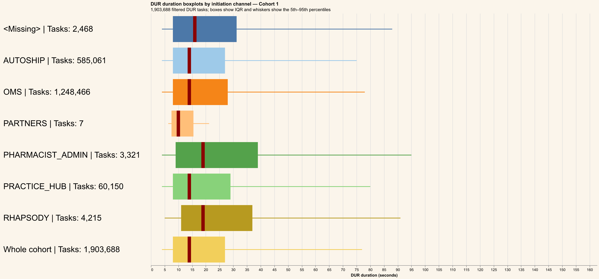
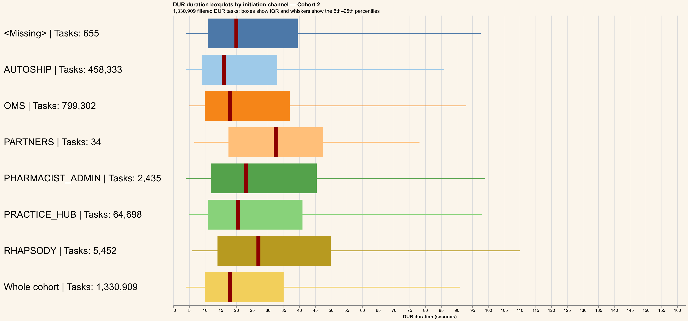
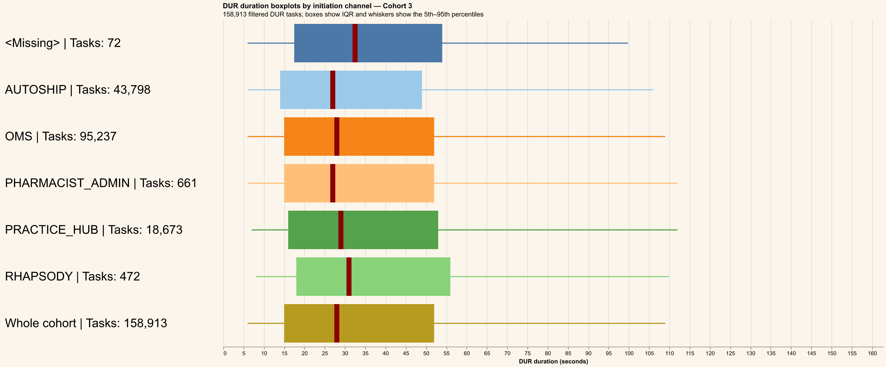
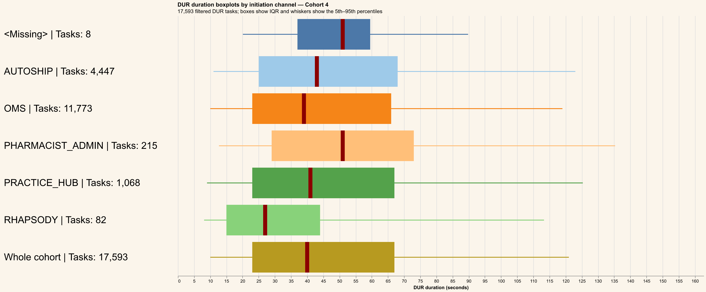
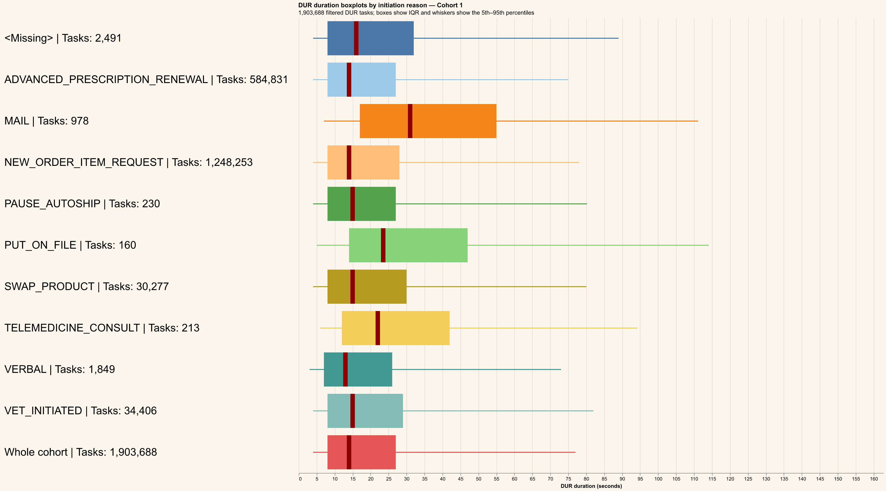
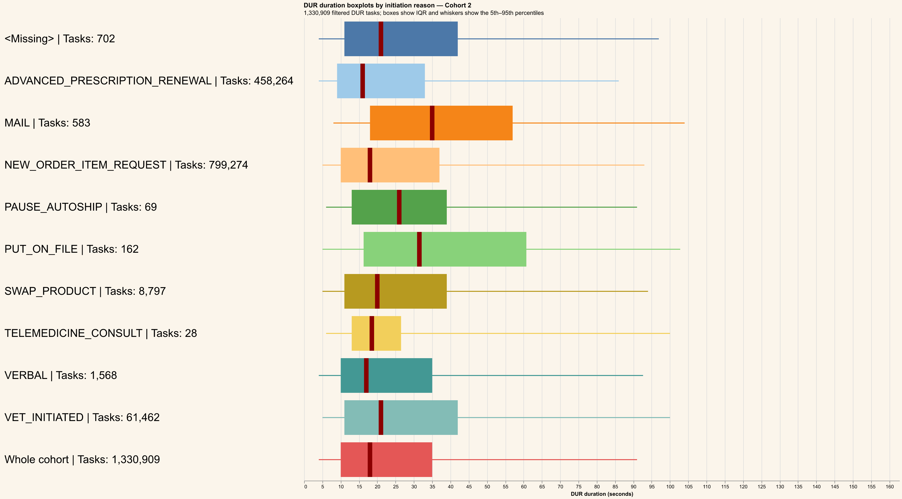
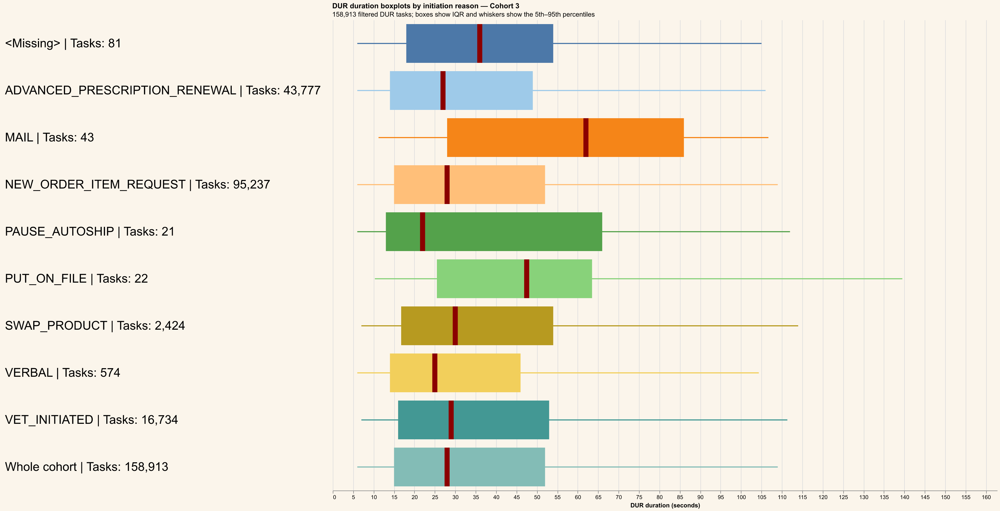
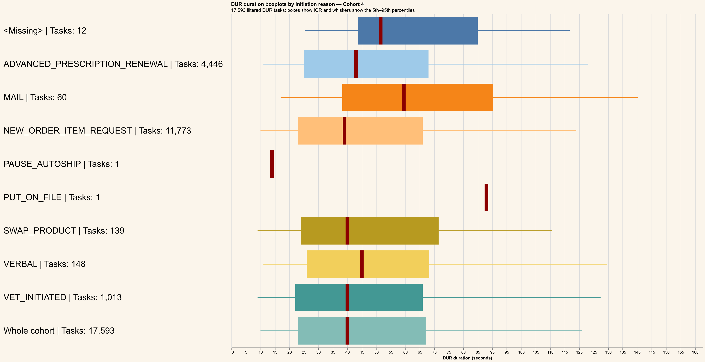

# Initiation channel and reason analysis

Valid DUR tasks are selected from `MY_RXP_VALID_DUR_TASKS` for Cohorts 1–4.
Durations at or above the global approximate 95th percentile are excluded.
Null or blank `INITIATION_CHANNEL` and `INITIATION_REASON` values are shown as `<Missing>`.
Each chart contains a horizontal boxplot for every grouping value plus a final `Whole cohort` reference boxplot. Labels show filtered task counts, dark-red lines show medians, and whiskers show the 5th–95th percentiles.
Cached task-level data is stored at `outputs/data/initiation-channel-analysis.parquet` for redraw-only runs.

## Initiation channel — Cohort 1

## Initiation channel — Cohort 2

## Initiation channel — Cohort 3

## Initiation channel — Cohort 4

## Initiation reason — Cohort 1

## Initiation reason — Cohort 2

## Initiation reason — Cohort 3

## Initiation reason — Cohort 4

