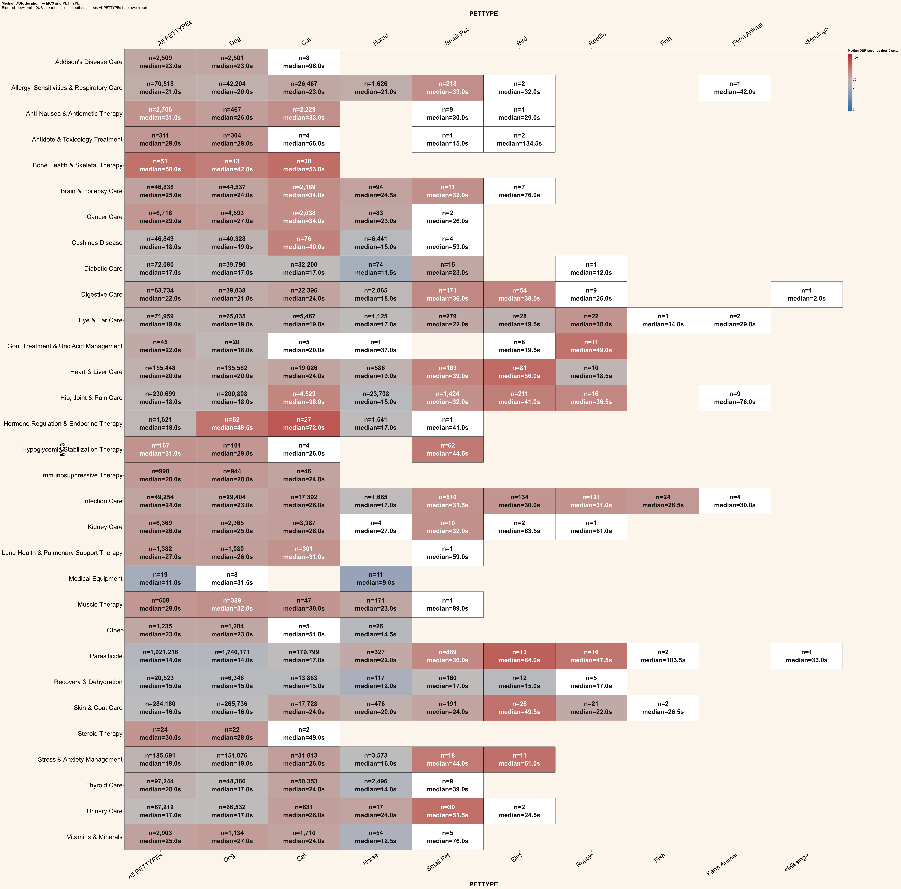
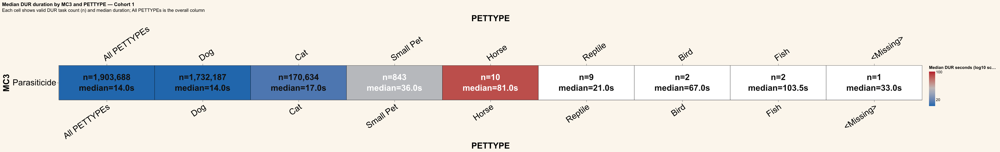
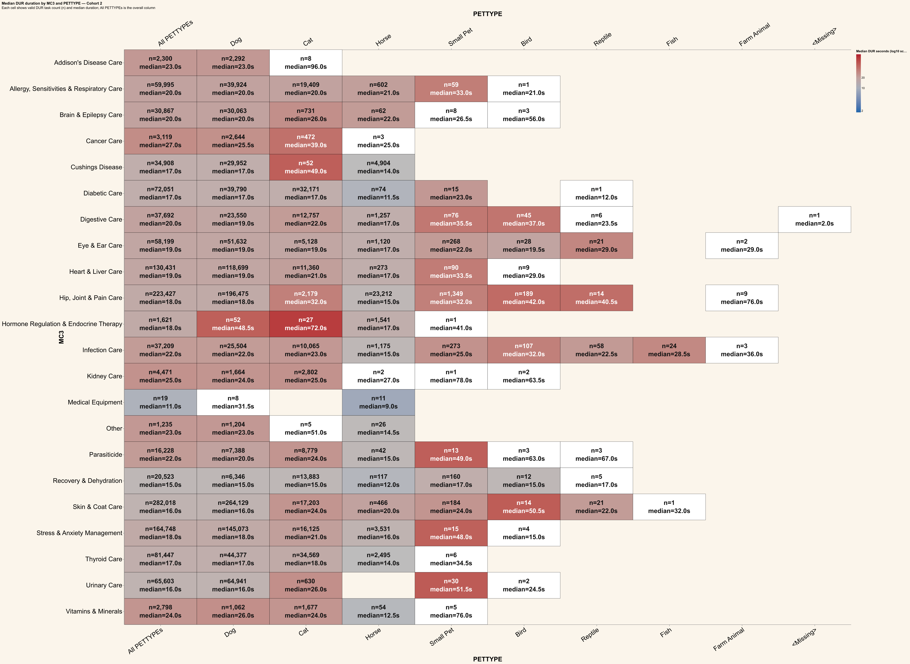
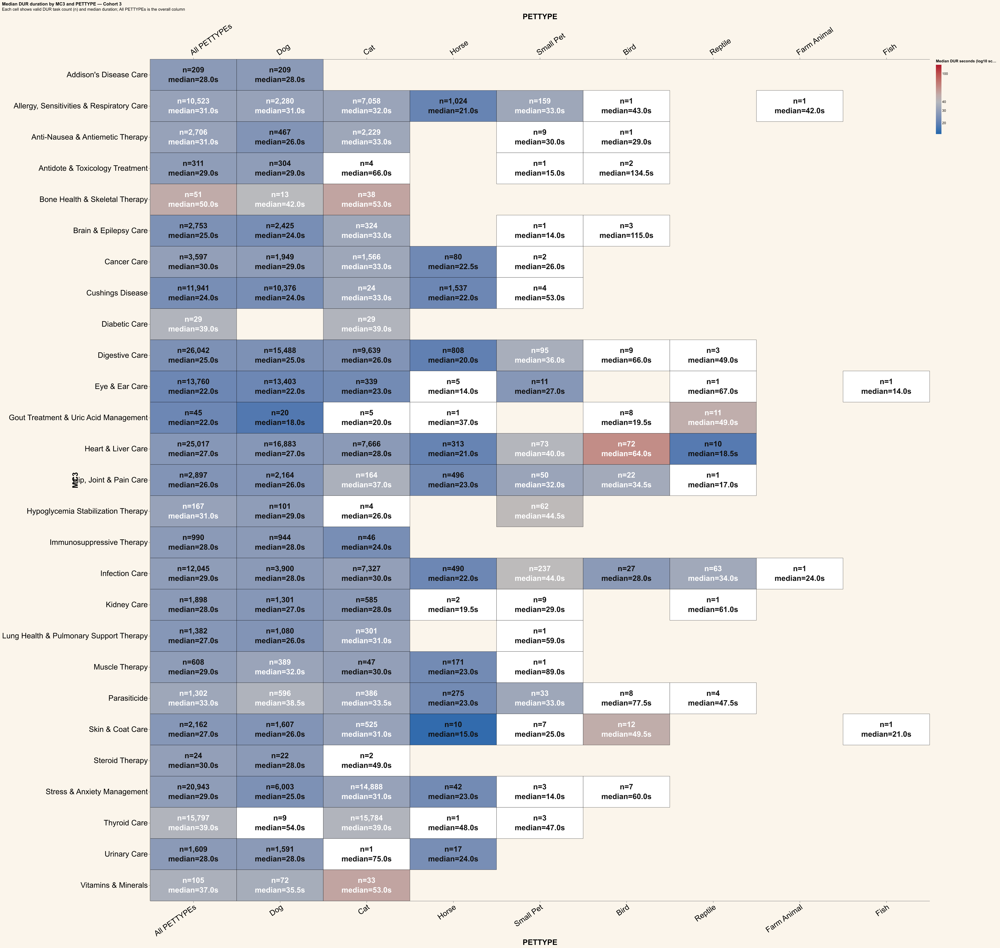
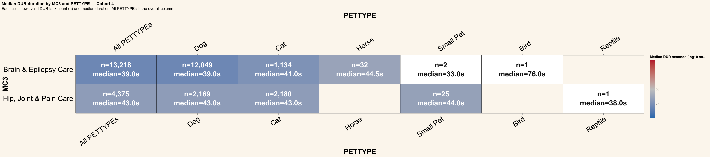

# MC3 and PETTYPE analysis

Valid DUR tasks from Cohorts 1–4 are filtered to durations strictly below one global approximate 95th-percentile cutoff.
Rows are MC3 categories and columns are PETTYPE values ordered by descending valid DUR task count, with `All PETTYPEs` first. Each cell shows the valid DUR task count (`n`) and median duration. Cell colors use a log10 duration scale for cells with `n >= 10`: blue is lowest, gray is mid-range, and red is highest. Cells with fewer than 10 tasks are white.
The all-cohort chart and one chart per cohort are generated from cached aggregate data stored at `outputs/data/mc3-pettype-analysis.parquet` for redraw-only runs.

## All cohorts

## Cohort 1

## Cohort 2

## Cohort 3

## Cohort 4

