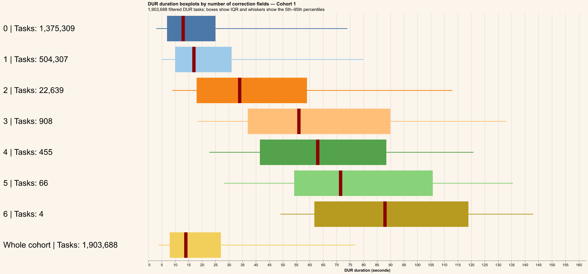
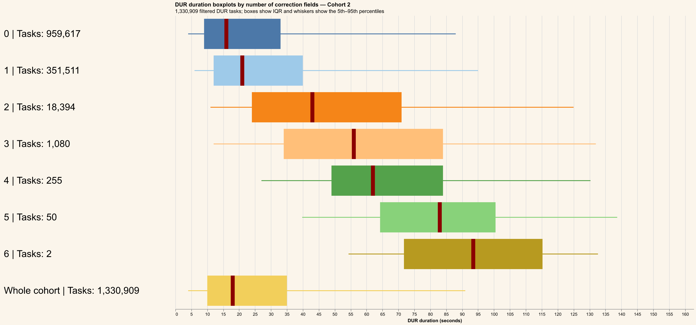
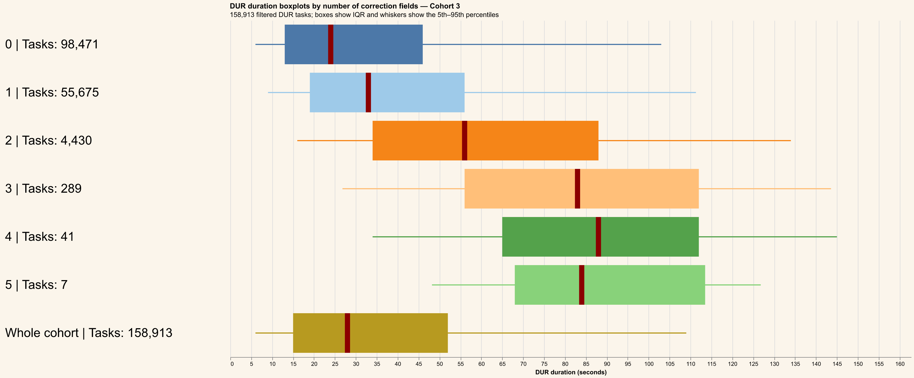
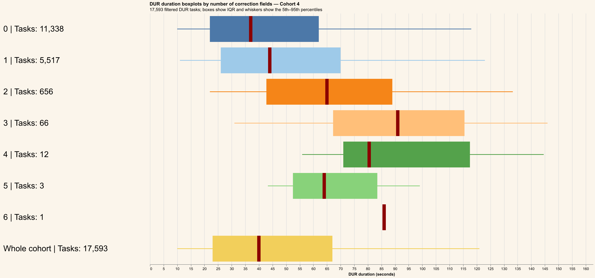

# Number of correction fields analysis

Valid DUR tasks are selected from `MY_RXP_VALID_DUR_TASKS` for Cohorts 1–4.
Durations at or above the global approximate 95th percentile are excluded.
`NCORRECTION_FIELDS` is grouped as the number of distinct correction fields matched to each task, with missing values represented as `0`.
Each chart contains a horizontal boxplot for every correction-field count plus a final `Whole cohort` reference boxplot. Labels show filtered task counts, and dark-red lines show medians.
Cached task-level data is stored at `outputs/data/ncorrection-fields-analysis.parquet` for redraw-only runs.

## Cohort 1

## Cohort 2

## Cohort 3

## Cohort 4

