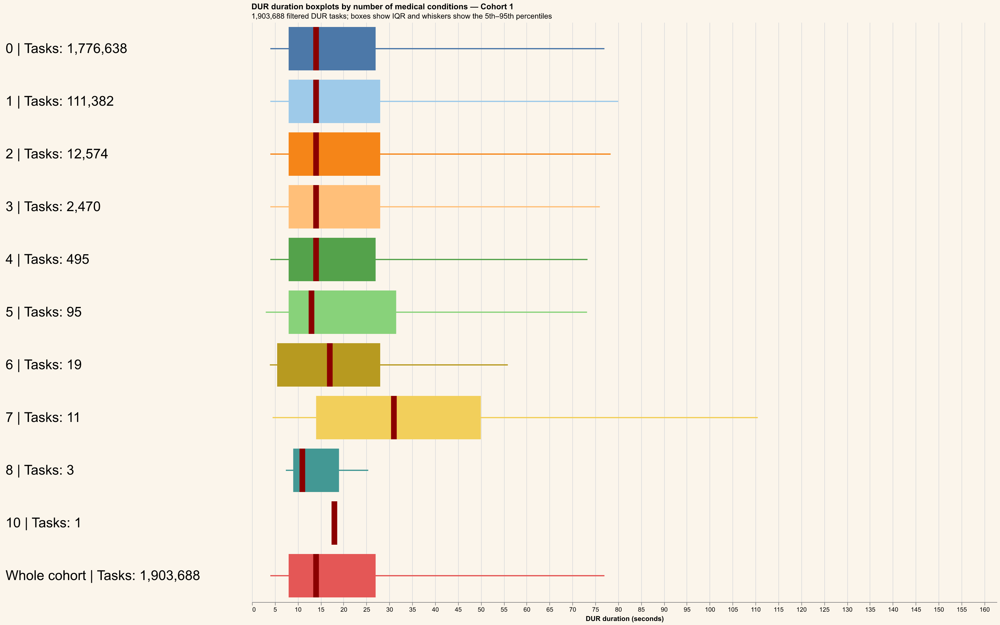
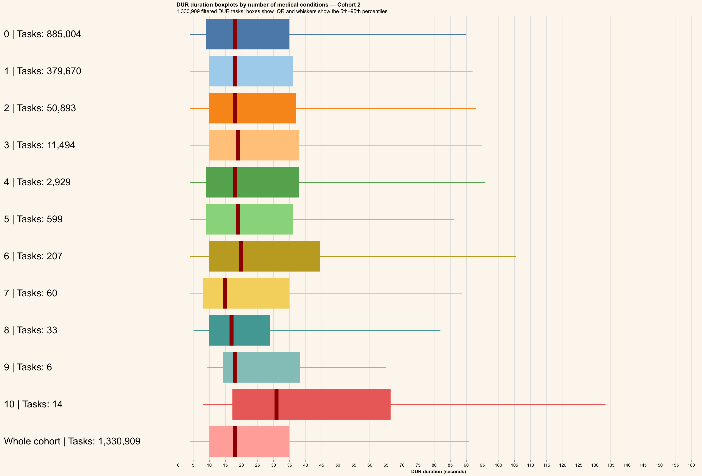
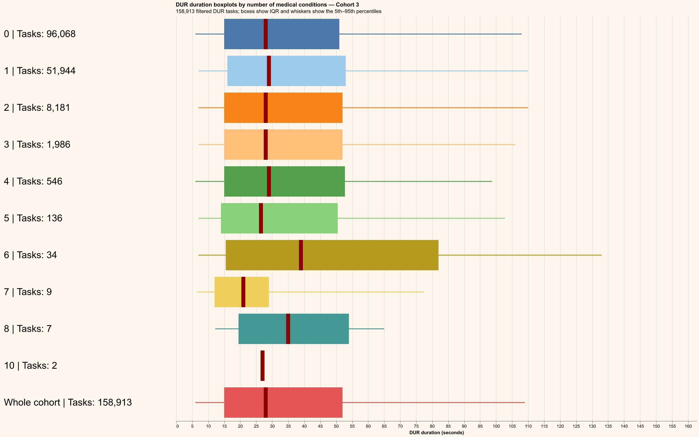
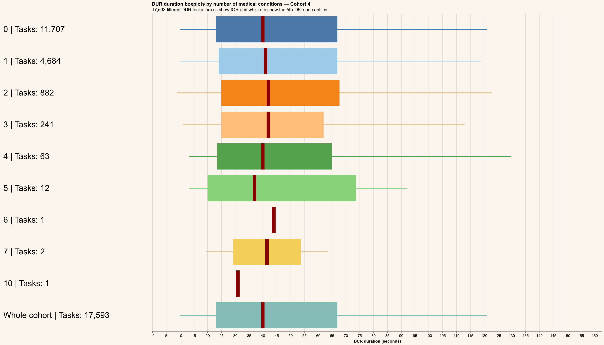

# NPET_CONDITIONS analysis

Valid DUR tasks are selected from `MY_RXP_VALID_DUR_TASKS` for Cohorts 1–4.
Durations at or above the global approximate 95th percentile are excluded.
`NPET_CONDITIONS` is grouped as the number of medical conditions, with unmatched or empty profiles represented as `0`.
Each chart contains a horizontal boxplot for every condition count plus a final `Whole cohort` reference boxplot. Labels show filtered task counts, and dark-red lines show medians.
Cached task-level data is stored at `outputs/data/npet-conditions-analysis.parquet` for redraw-only runs.

## Cohort 1

## Cohort 2

## Cohort 3

## Cohort 4

