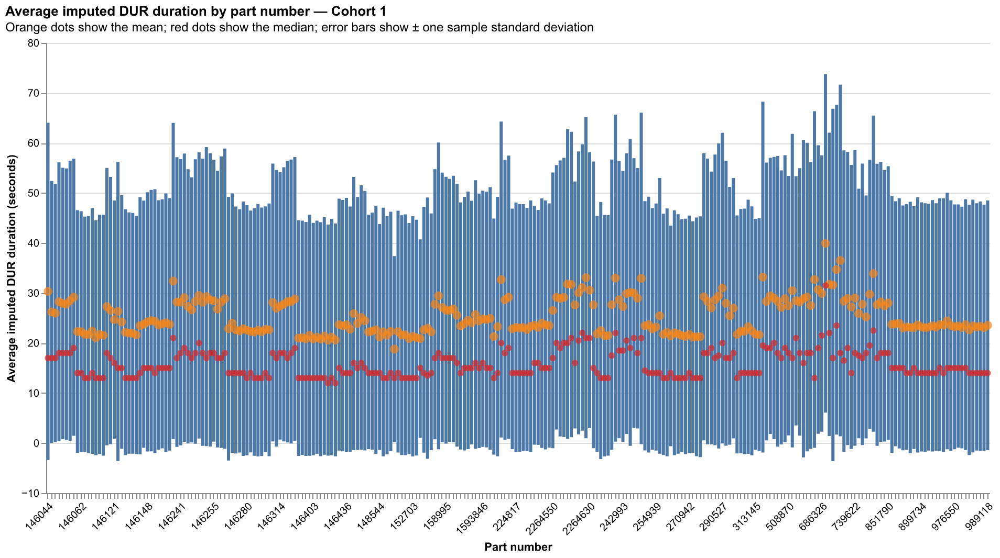
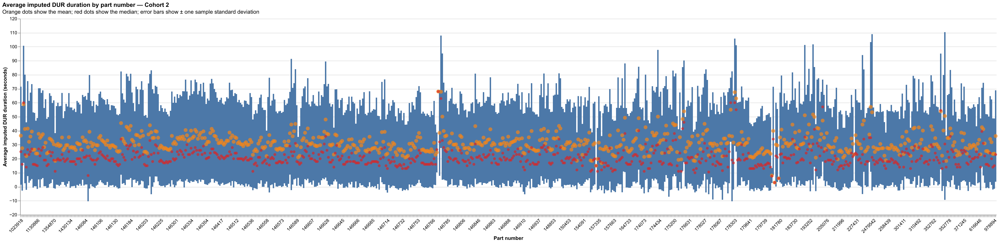
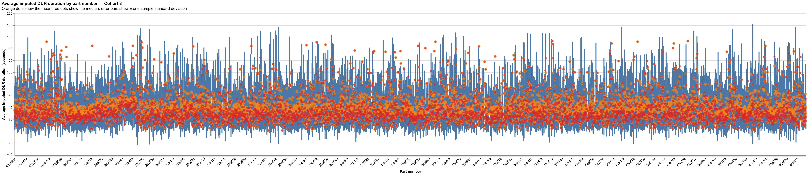
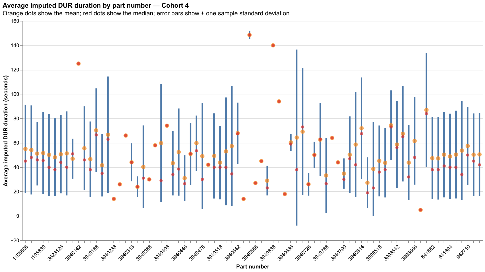
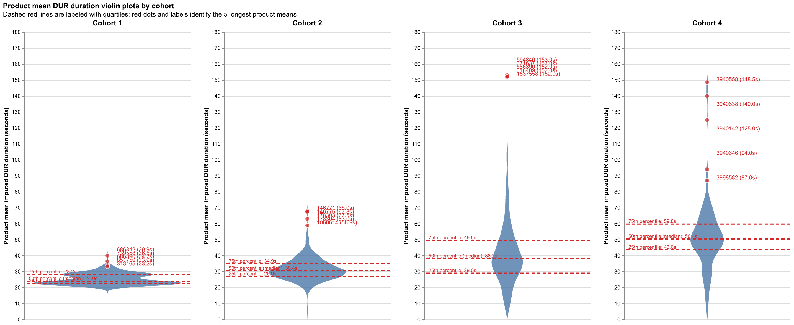

# Part-number analysis

DUR tasks are filtered to known cohorts, non-refill tasks, no handoff, and part numbers that are not null or blank.
Durations at or above the filtered population's approximate 95th percentile are excluded.
Orange points show average and red points show median `IMPUTED_DWELL_IN_PROGRESS_TO_CLOSED_SECONDS`; error bars show one sample standard deviation.
The combined violin plot uses product-level mean durations; labeled red dots identify the 5 part numbers with the longest mean in each cohort, and labeled dashed red lines show the quartiles.
Tooltips include median duration, distinct task count, and distinct user count.
Cached aggregate data is stored at `outputs/data/part-number-analysis.parquet` for redraw-only runs.

## Cohort 1

## Cohort 2

## Cohort 3

## Cohort 4

## Product mean duration violin plots

