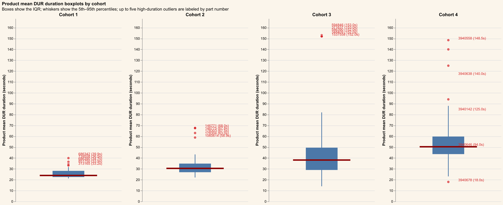

# Part-number analysis

DUR tasks are filtered to known cohorts, non-refill tasks, no handoff, and part numbers that are not null or blank.
Durations at or above the filtered population's approximate 95th percentile are excluded.
The combined boxplot uses product-level mean durations; boxes show the interquartile range and whiskers show the 5th–95th percentiles.
Red points outside the whiskers are labeled with their part numbers.
Tooltips include median duration, distinct task count, and distinct user count.
Cached aggregate data is stored at `outputs/data/part-number-analysis.parquet` for redraw-only runs.

## Product mean duration boxplots

