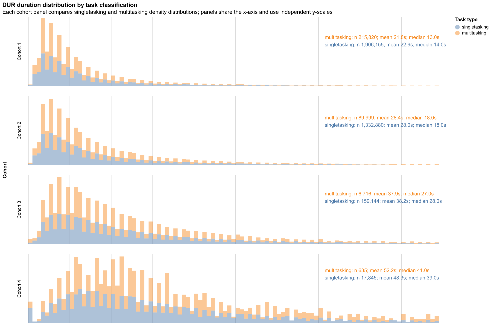

# DUR duration distributions by task classification

Filters: `TASK_TYPE = 'DUR'`, `COH <> 'Unknown'`, `LOWER(IS_REFILL) = 'false'`, and `HANDOFF_TYPE IS NULL`.
Durations use `IMPUTED_DWELL_IN_PROGRESS_TO_CLOSED_SECONDS`; values at or above the filtered population's approximate 95th percentile are excluded. The combined chart shows per-cohort density distributions using a shared x-axis, independent y-scales from zero, and 100 bins.
Each cohort panel is annotated with task count, mean, and median duration for both classifications.
The cached aggregate data is stored at `outputs/data/task-intersection-duration-distributions.parquet` for redraw-only runs.

## Singletasking and multitasking

