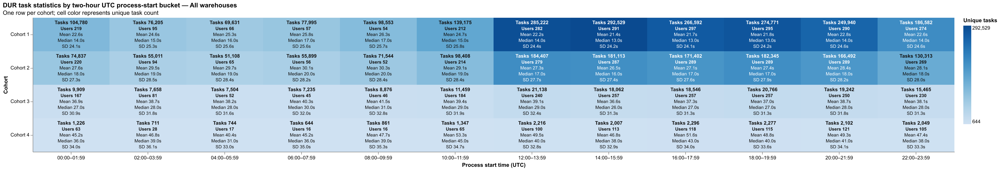
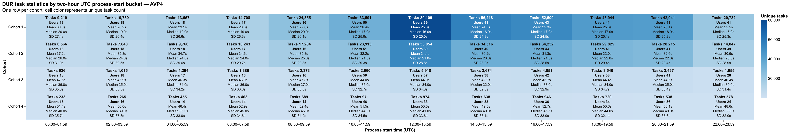
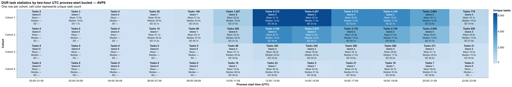
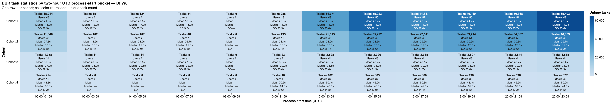
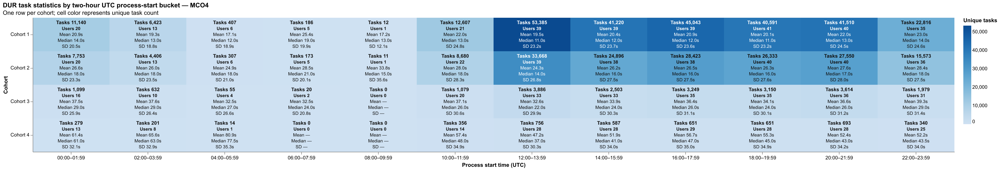
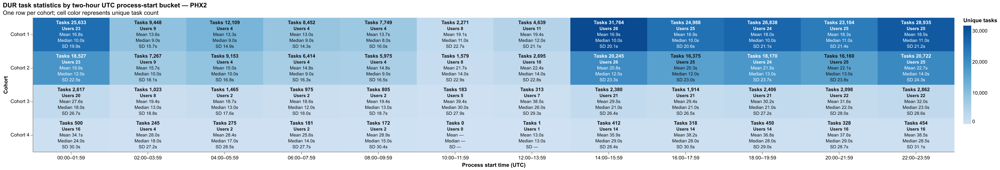
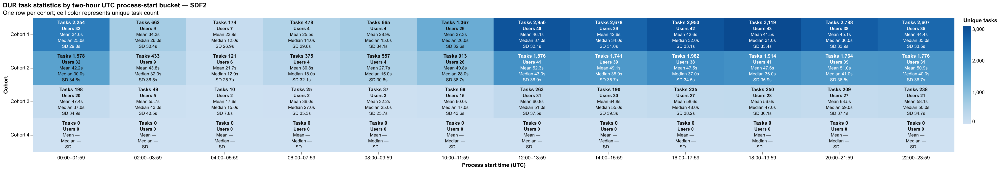
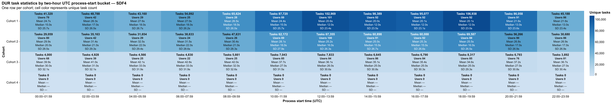
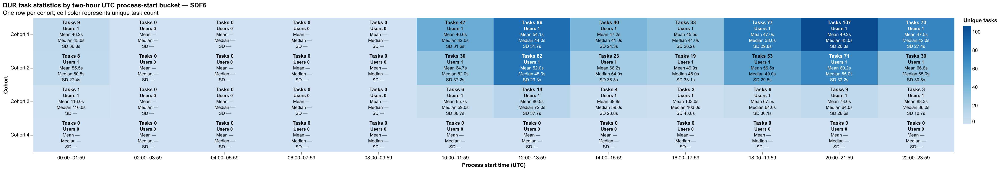

# Task time-bucket distributions

Each chart groups DUR tasks into twelve two-hour UTC process-start buckets and shows unique task count, unique user count, and imputed-dwell mean, median, and standard deviation.
Values at or above the filtered population's approximate 95th percentile are excluded.
Cached aggregate data is stored at `outputs/data/task-time-bucket-distribution.parquet` for redraw-only runs.

## All warehouses

## AVP4

## AVP6

## DFW8

## MCO4

## PHX2

## SDF2

## SDF4

## SDF6

