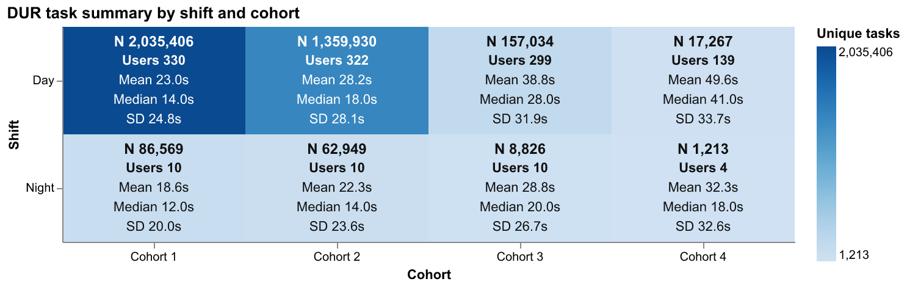
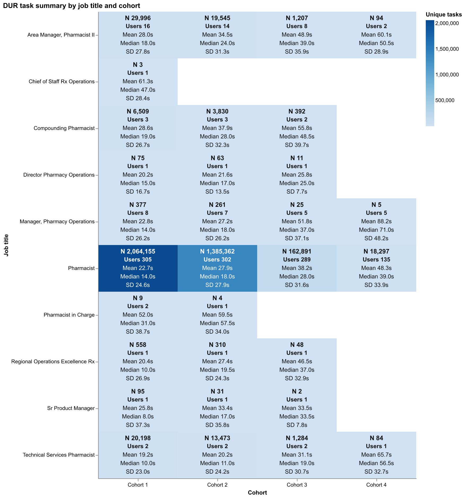
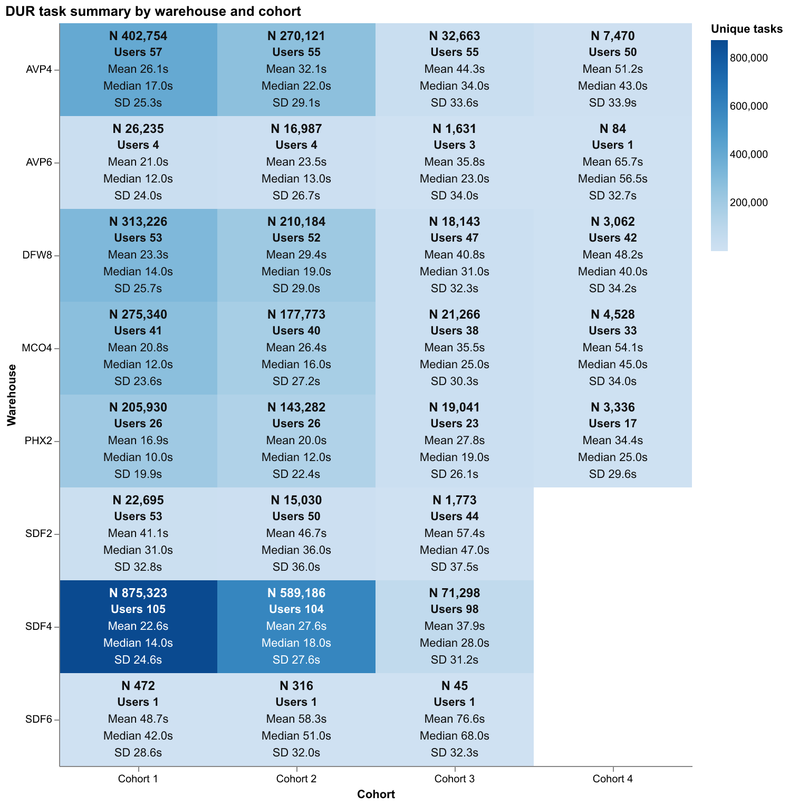
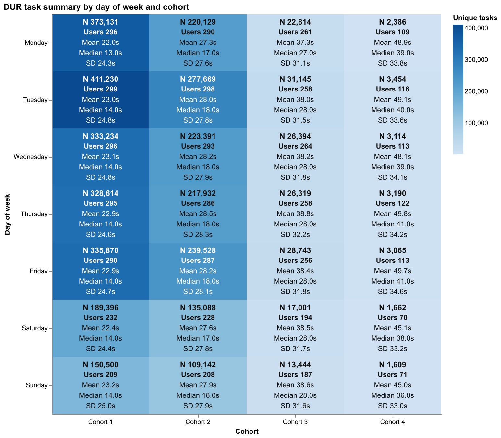
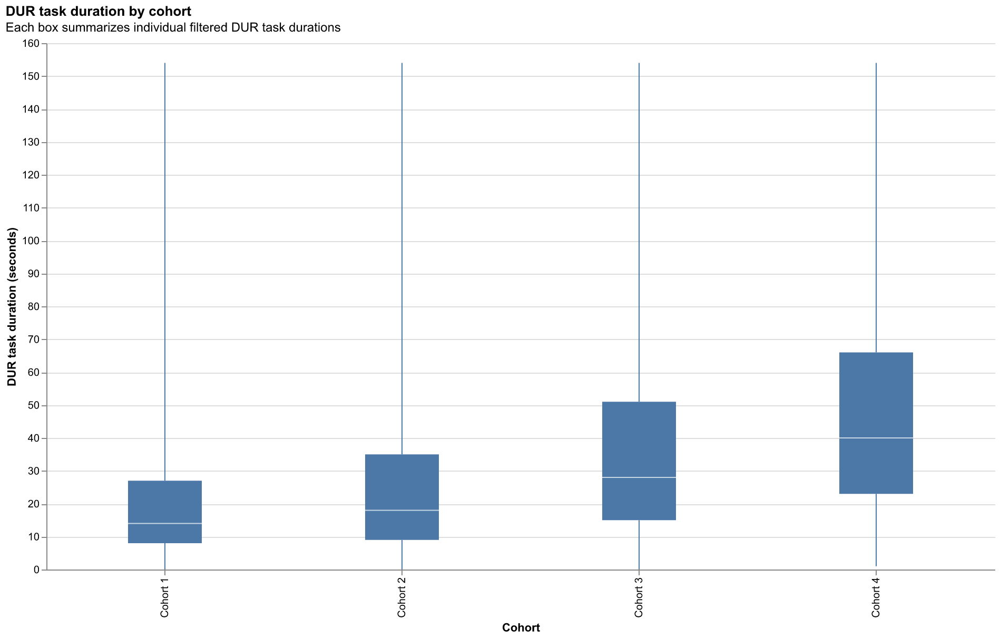
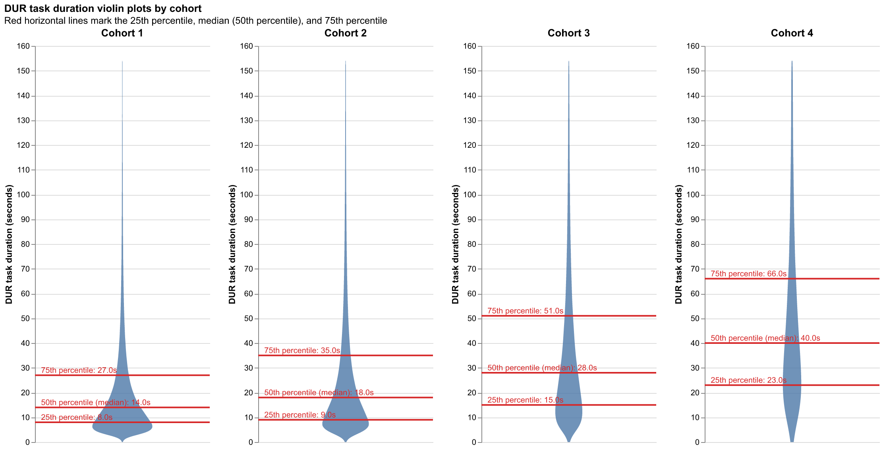

# Task-based distributions

Filters: `TASK_TYPE = 'DUR'`, `COH <> 'Unknown'`, `LOWER(IS_REFILL) = 'false'`, and `HANDOFF_TYPE IS NULL`.
Duration statistics use `IMPUTED_DWELL_IN_PROGRESS_TO_CLOSED_SECONDS`.
Values at or above the filtered population's approximate 95th percentile are excluded.
Each cell includes distinct task and user counts.
Cached aggregate data is stored at `outputs/data/task-based-distributions.parquet` for redraw-only runs.

## Task summary by shift and cohort

## Task summary by job title and cohort

## Task summary by warehouse and cohort

## Task summary by day of week and cohort

## DUR task duration by cohort boxplots

## DUR task duration by cohort violin plots

