# Task-based distributions

Filters: `TASK_TYPE = 'DUR'`, `COH <> 'Unknown'`, `LOWER(IS_REFILL) = 'false'`, and `HANDOFF_TYPE IS NULL`.
Duration statistics use `IMPUTED_DWELL_IN_PROGRESS_TO_CLOSED_SECONDS`.
Values at or above the filtered population's approximate 95th percentile are excluded.
Each cell includes distinct task and user counts.
Job-title boxplots use the task-level cache and include one PNG for each cohort plus one all-cohort PNG. Each boxplot includes a summary table with DUR count, median, maximum, average, and standard deviation by job title. The job-title count strip shows filtered DUR task counts across all cohorts.
Cached aggregate data is stored at `outputs/data/task-based-distributions.parquet` for redraw-only runs.

## Task summary by shift and cohort

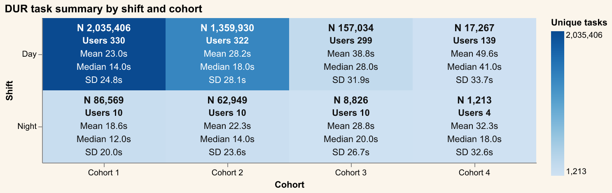

## Task summary by job title and cohort

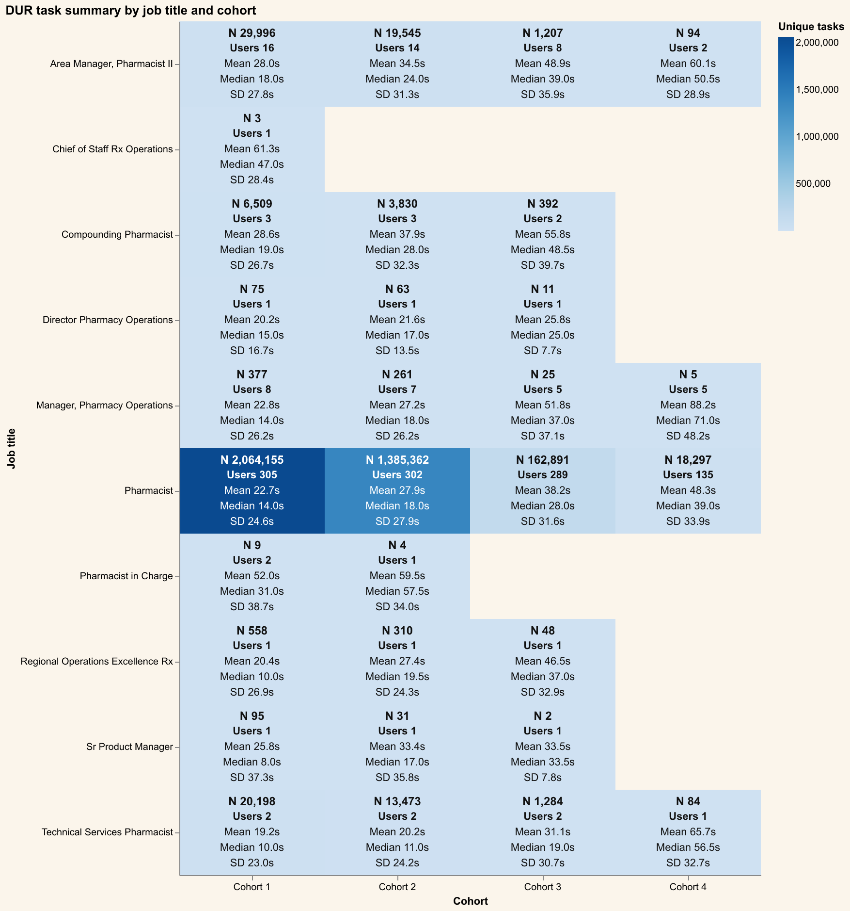

## Task summary by warehouse and cohort

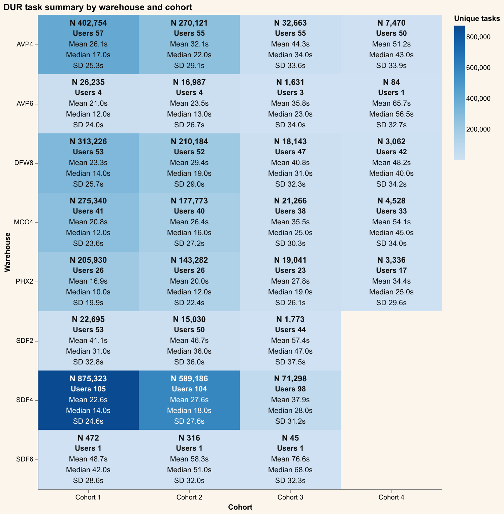

## Task summary by day of week and cohort

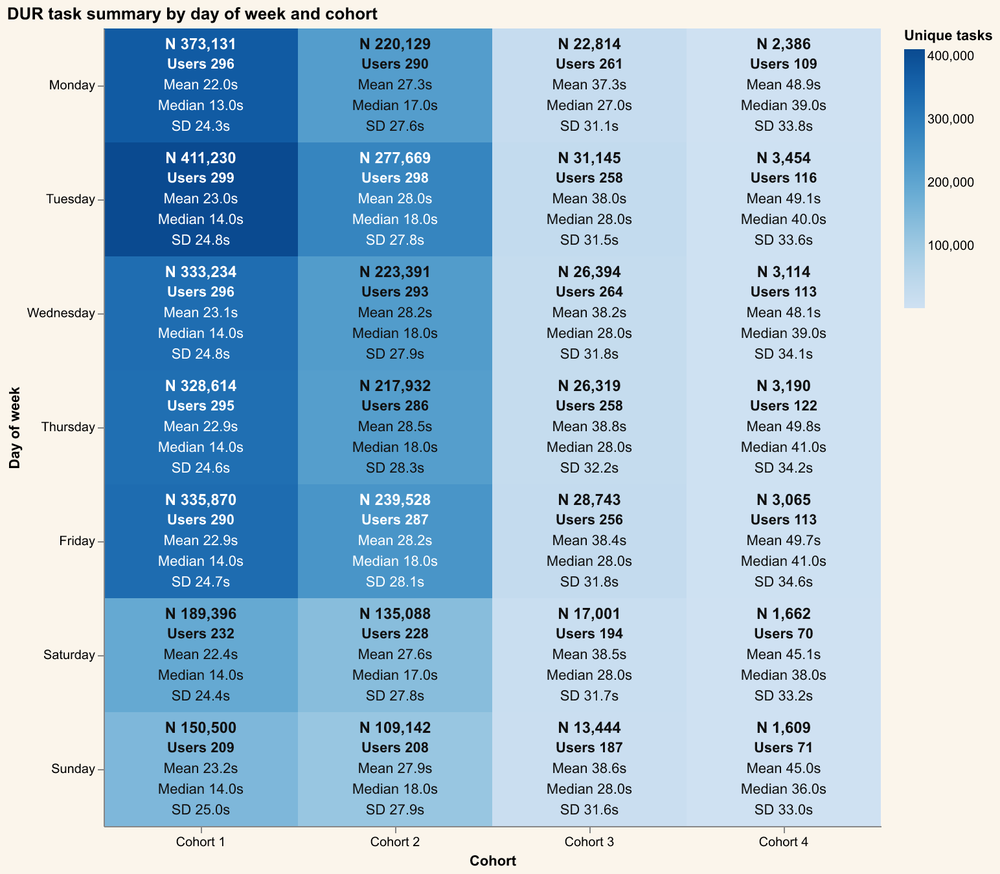

## DUR task duration by cohort boxplots

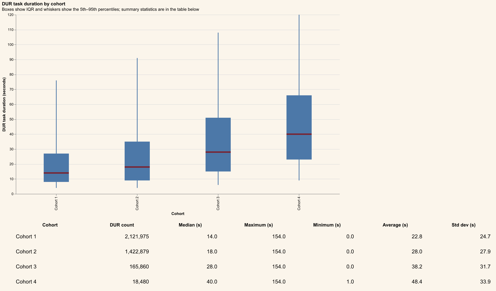

## DUR task duration by cohort violin plots

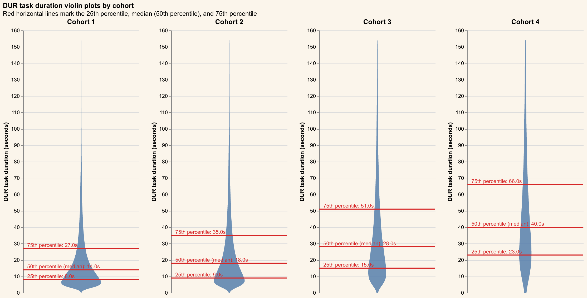

## DUR duration by job title — Cohort 1

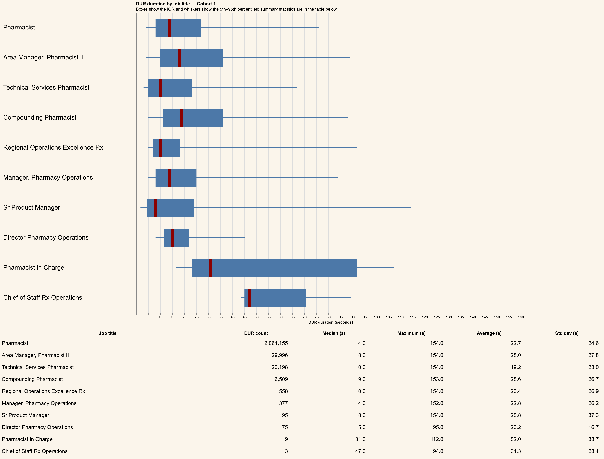

## DUR duration by job title — Cohort 2

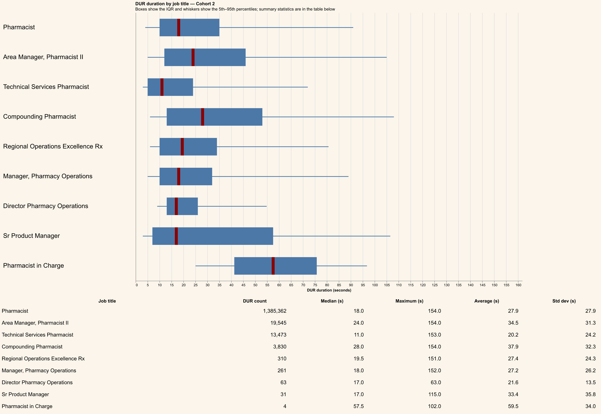

## DUR duration by job title — Cohort 3

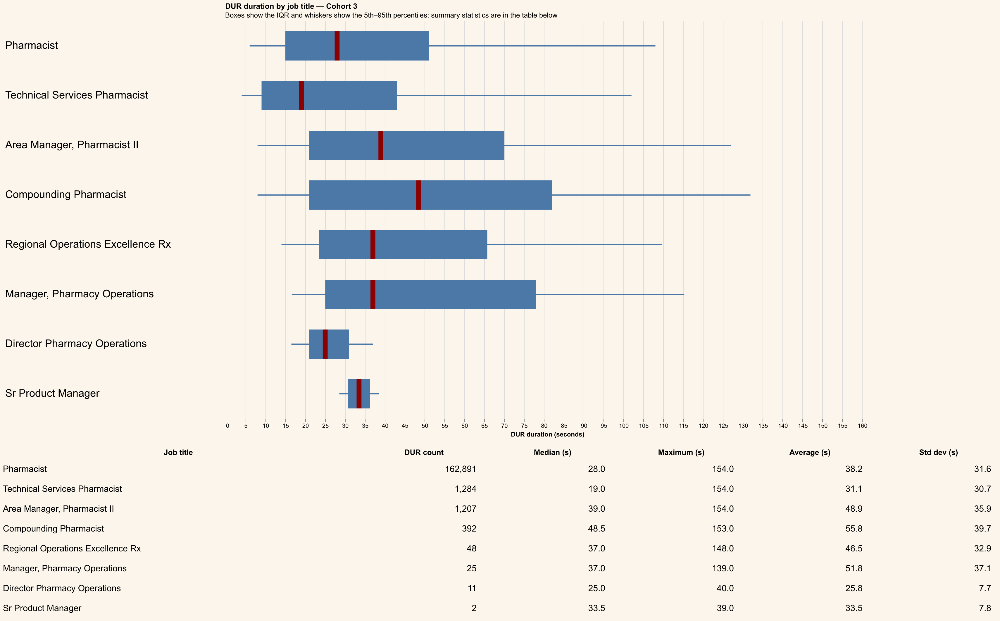

## DUR duration by job title — Cohort 4

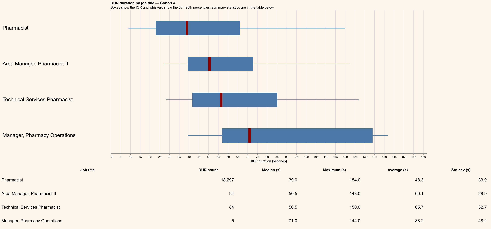

## DUR duration by job title — All cohorts

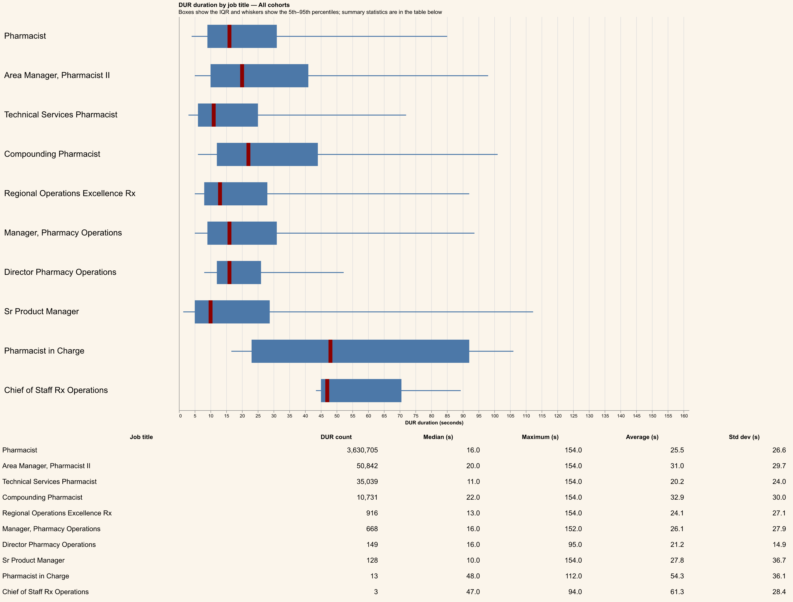

## Filtered DUR task counts by job title

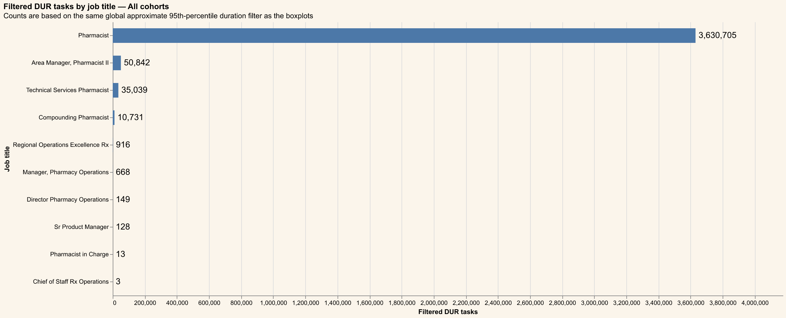
