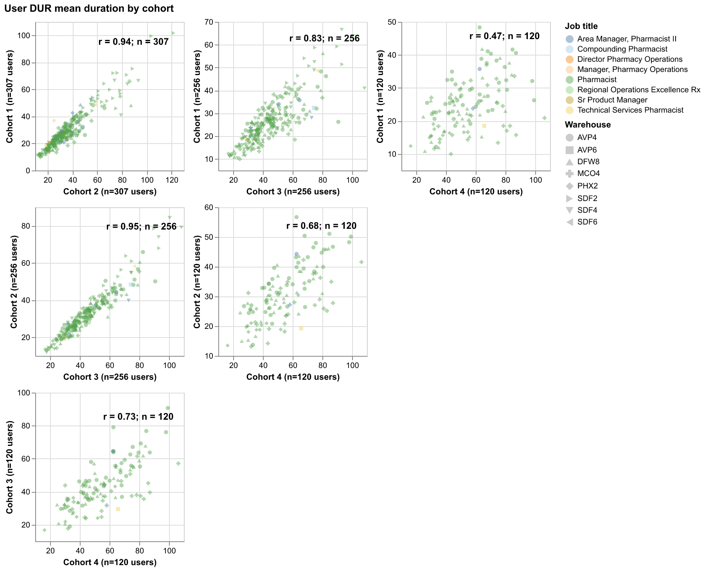
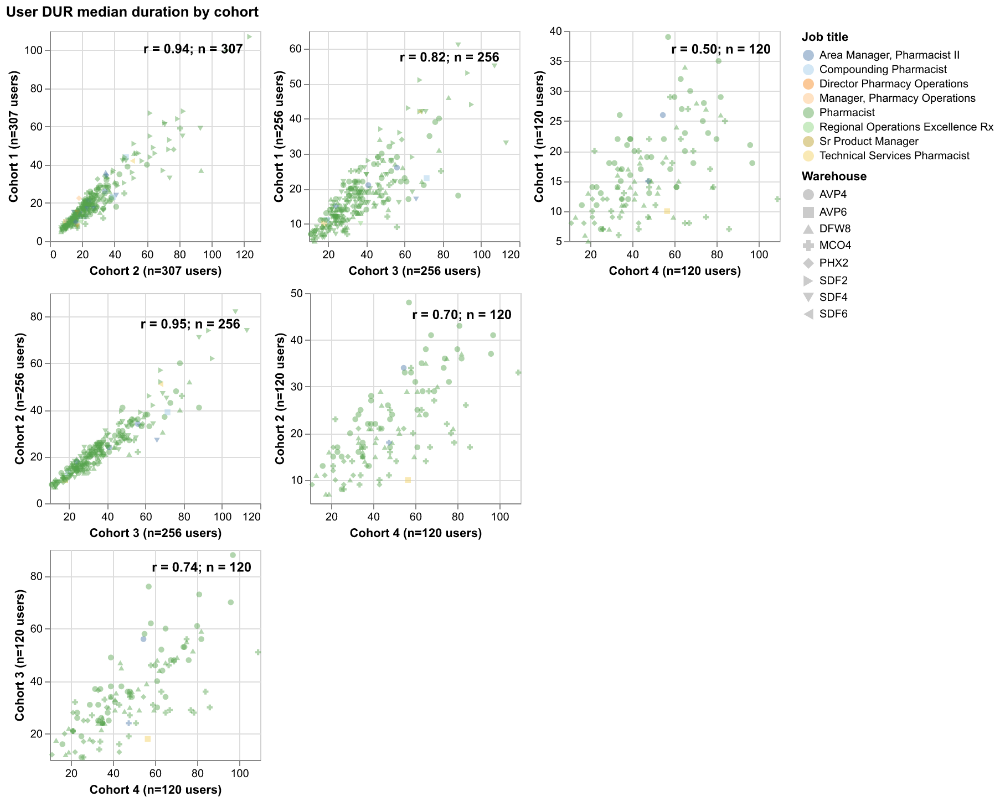
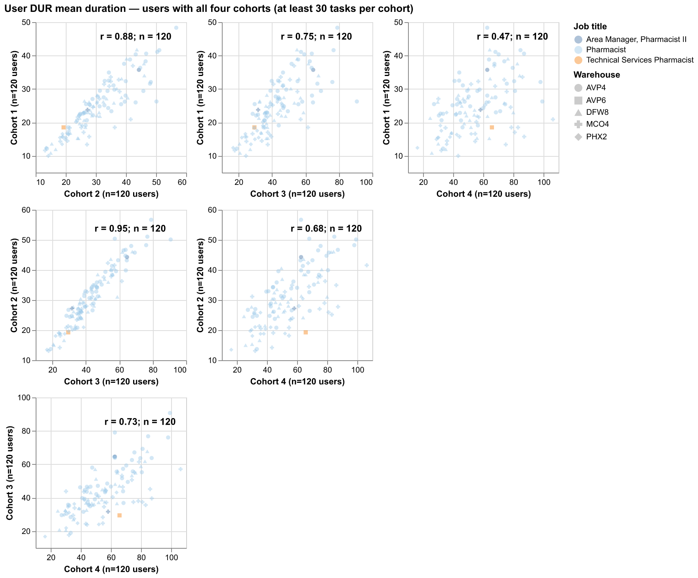
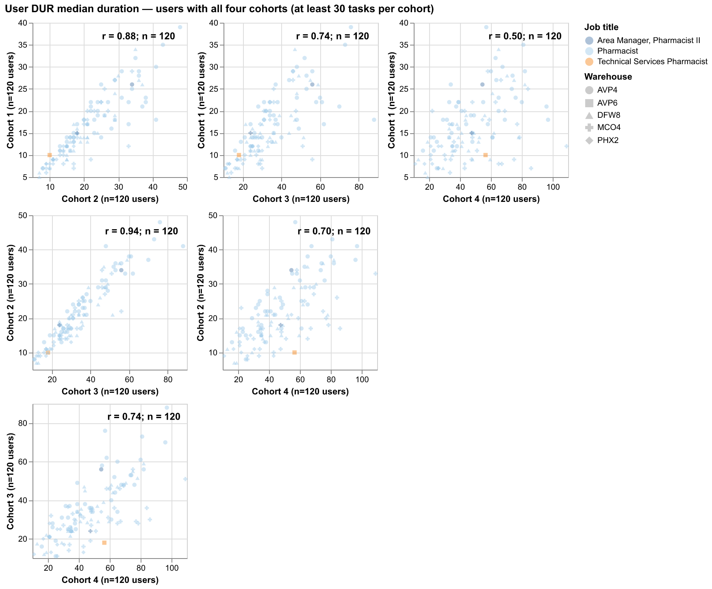
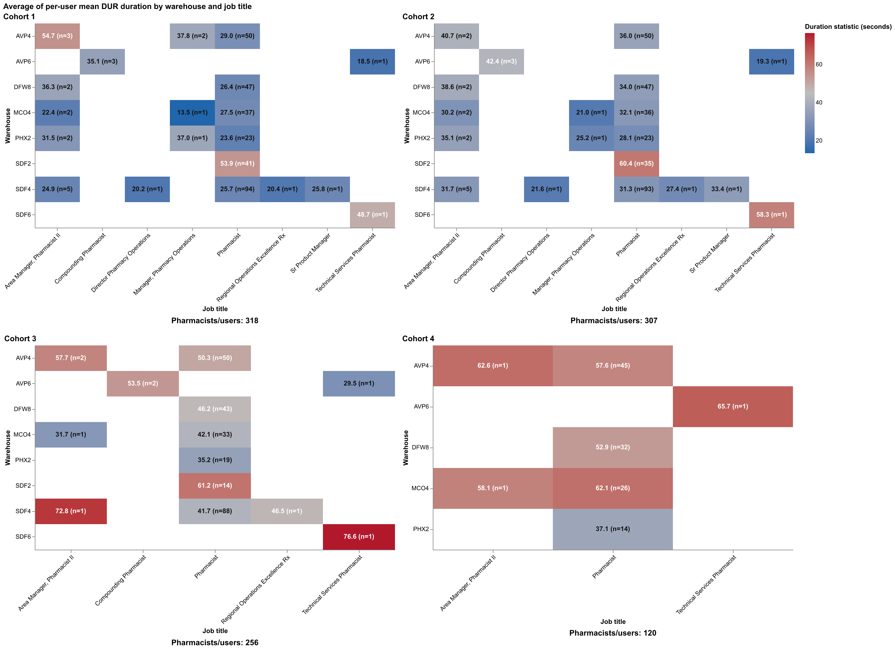
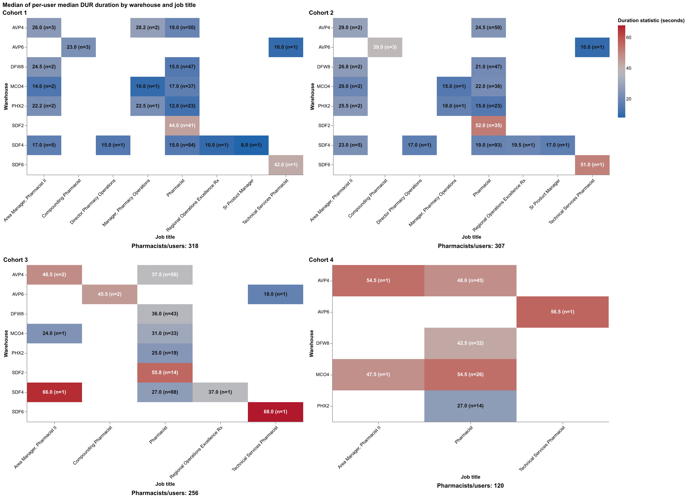
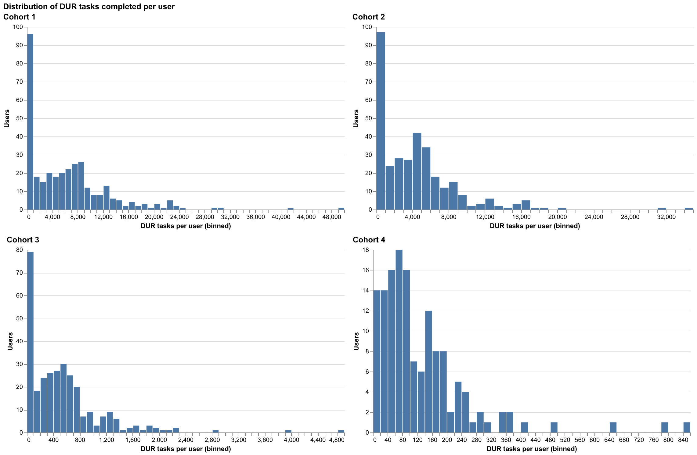
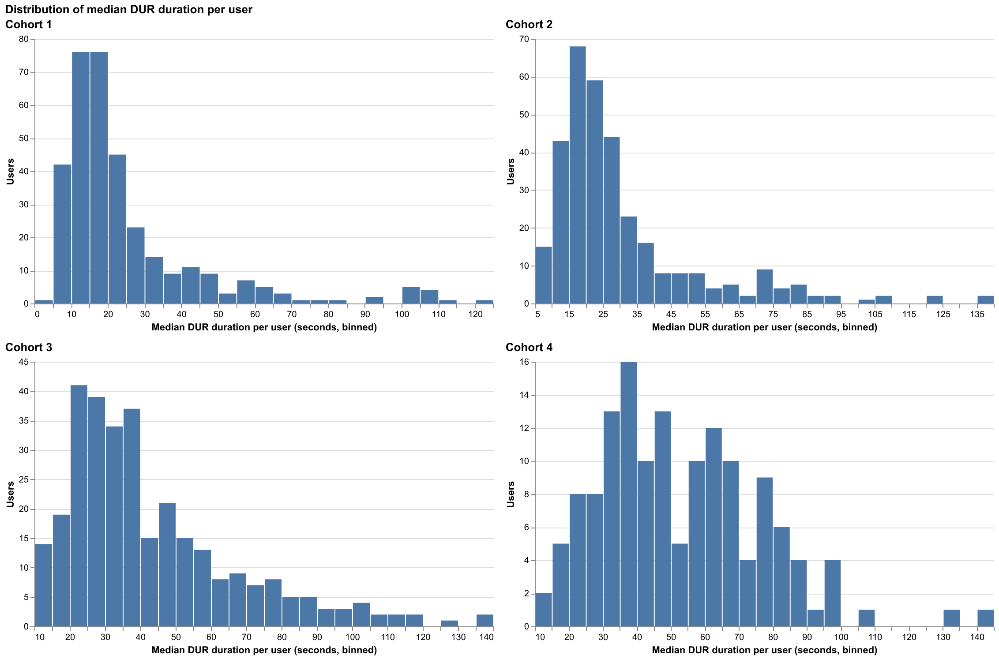

# User performance by cohort

Durations at or above the filtered population's approximate 95th percentile are excluded.
Each pairwise scatter cell includes users with at least 30 tasks in both compared cohorts, displays Pearson's r and the eligible-user count, colors points by job title, and shapes them by warehouse.

## Mean duration

## Median duration

## Mean duration — users with all four cohorts

## Median duration — users with all four cohorts

## Average of per-user means by warehouse and job title

## Median of per-user medians by warehouse and job title

## Distribution of DUR tasks per user

## Distribution of median DUR duration per user

