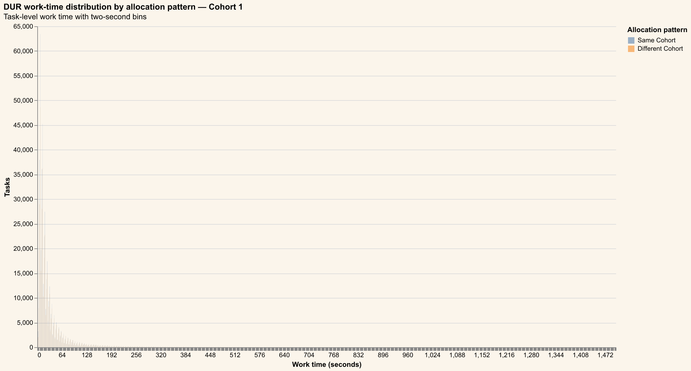
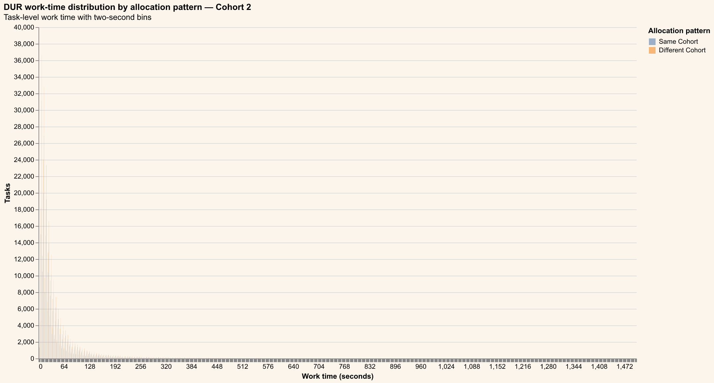
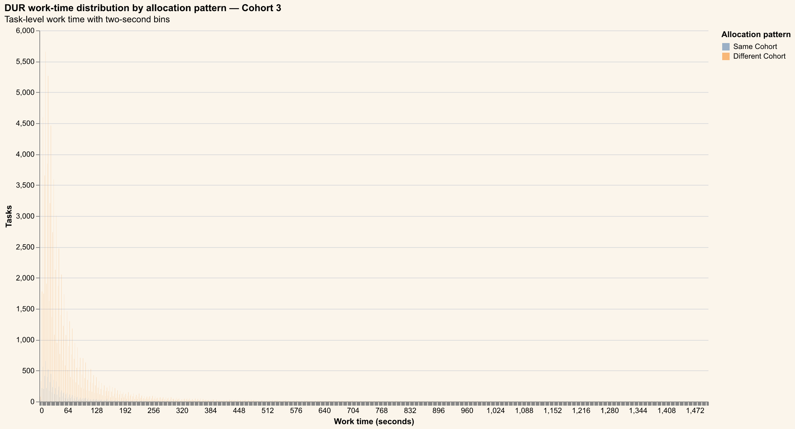
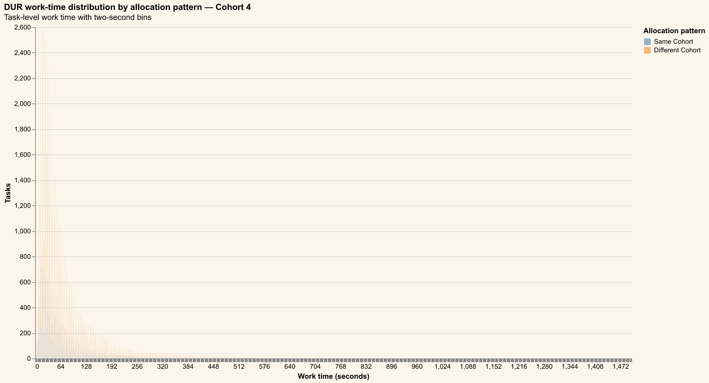

# Santhosh Query Analysis

## Purpose

This analysis compares task work time for consecutive DUR tasks allocated to the
same cohort versus a different cohort, separately for Cohorts 1–4. Work time is
`DWELL_IN_PROGRESS_TO_CLOSED_MINUTES`, measured in minutes.

The source query keeps the original filters: transitions on or after
2026-08-01, DUR tasks with final status `CLOSED`, non-null user and start time,
work time between 0.01 and 30 minutes, and known item cohorts. The previous
cohort is calculated within user and transition date, ordered by `STARTED_AT`.
Rows without a previous cohort are excluded. Distribution charts use two-second
bins after converting work time from minutes to seconds.

## Hypothesis test

The primary test is a two-sided Welch two-sample t-test. The null hypothesis is
that the two population means are equal; the alternative is that they differ.
The reported contrast is **Same Cohort − Different Cohort**, with alpha = 0.05.

## Cohort 1



| Allocation pattern | Tasks | Mean (min) | SD (min) | Median (min) | P25 (min) | P75 (min) |
|---|---:|---:|---:|---:|---:|---:|
| Same Cohort | 464,716 | 0.6864 | 1.6594 | 0.2667 | 0.1500 | 0.5500 |
| Different Cohort | 383,270 | 0.7486 | 1.7677 | 0.2833 | 0.1500 | 0.6167 |

| Quantity | Result |
|---|---:|
| Same Cohort mean (minutes) | 0.6864 |
| Different Cohort mean (minutes) | 0.7486 |
| Mean difference (minutes) | -0.0622 |
| 95% CI for mean difference | [-0.0696, -0.0549] |
| Welch t-statistic | -16.5797 |
| Welch degrees of freedom | 796024.3236 |
| Two-sided p-value | 1.00014e-61 |

At the 0.05 level, we **reject** the null hypothesis for Cohort 1.

## Cohort 2



| Allocation pattern | Tasks | Mean (min) | SD (min) | Median (min) | P25 (min) | P75 (min) |
|---|---:|---:|---:|---:|---:|---:|
| Same Cohort | 316,985 | 0.8807 | 1.8554 | 0.3667 | 0.1833 | 0.8000 |
| Different Cohort | 384,471 | 0.8965 | 1.8867 | 0.3667 | 0.1833 | 0.8000 |

| Quantity | Result |
|---|---:|
| Same Cohort mean (minutes) | 0.8807 |
| Different Cohort mean (minutes) | 0.8965 |
| Mean difference (minutes) | -0.0159 |
| 95% CI for mean difference | [-0.0246, -0.0071] |
| Welch t-statistic | -3.5355 |
| Welch degrees of freedom | 680225.6028 |
| Two-sided p-value | 0.00040709 |

At the 0.05 level, we **reject** the null hypothesis for Cohort 2.

## Cohort 3



| Allocation pattern | Tasks | Mean (min) | SD (min) | Median (min) | P25 (min) | P75 (min) |
|---|---:|---:|---:|---:|---:|---:|
| Same Cohort | 9,975 | 1.1783 | 2.1497 | 0.5500 | 0.2667 | 1.1500 |
| Different Cohort | 97,245 | 1.2265 | 2.1568 | 0.5833 | 0.3000 | 1.2167 |

| Quantity | Result |
|---|---:|
| Same Cohort mean (minutes) | 1.1783 |
| Different Cohort mean (minutes) | 1.2265 |
| Mean difference (minutes) | -0.0482 |
| 95% CI for mean difference | [-0.0925, -0.0039] |
| Welch t-statistic | -2.1320 |
| Welch degrees of freedom | 12126.7487 |
| Two-sided p-value | 0.0330299 |

At the 0.05 level, we **reject** the null hypothesis for Cohort 3.

## Cohort 4



| Allocation pattern | Tasks | Mean (min) | SD (min) | Median (min) | P25 (min) | P75 (min) |
|---|---:|---:|---:|---:|---:|---:|
| Same Cohort | 15,344 | 1.6087 | 2.6346 | 0.7667 | 0.3833 | 1.6000 |
| Different Cohort | 57,454 | 1.5841 | 2.5902 | 0.7667 | 0.4167 | 1.5667 |

| Quantity | Result |
|---|---:|
| Same Cohort mean (minutes) | 1.6087 |
| Different Cohort mean (minutes) | 1.5841 |
| Mean difference (minutes) | 0.0247 |
| 95% CI for mean difference | [-0.0221, 0.0714] |
| Welch t-statistic | 1.0337 |
| Welch degrees of freedom | 23861.9380 |
| Two-sided p-value | 0.301268 |

At the 0.05 level, we **do not reject** the null hypothesis for Cohort 4.


Each result is an observational comparison of task means and does not establish
that cohort allocation causes the difference.

## Limitations

Welch's test allows unequal variances but treats task rows as independent.
Users and transition dates can contribute multiple tasks, so the p-value and
confidence interval should be interpreted as the requested row-level analysis,
not as a dependence-adjusted estimate. The cohort comparison also inherits the
source query's ordering and filtering choices.

## Query used

```sql
WITH ordered AS (
  SELECT
    TASK_ID,
    USER_ID,
    ITEM_COHORT,
    STARTED_AT,
    TRANSITION_STARTED_AT::DATE AS dt,
    LAG(ITEM_COHORT) OVER (
      PARTITION BY USER_ID, TRANSITION_STARTED_AT::DATE
      ORDER BY STARTED_AT
    ) AS prev_cohort,
    DWELL_IN_PROGRESS_TO_CLOSED_MINUTES AS work_min
  FROM EDLDB.PET_HEALTH_ANALYTICS_SANDBOX.FCT__TASKS_LIFECYCLE
  WHERE TRANSITION_STARTED_AT >= '2026-08-01'
    AND TASK_TYPE = 'DUR'
    AND FINAL_STATUS = 'CLOSED'
    AND USER_ID IS NOT NULL
    AND STARTED_AT IS NOT NULL
    AND DWELL_IN_PROGRESS_TO_CLOSED_MINUTES BETWEEN 0.01 AND 30
    AND ITEM_COHORT != 'Unknown'
)
SELECT
  TASK_ID AS task_id,
  USER_ID AS user_id,
  dt,
  CASE
    WHEN ITEM_COHORT = prev_cohort THEN 'Same Cohort'
    ELSE 'Different Cohort'
  END AS allocation_pattern,
  ITEM_COHORT AS cohort,
  work_min
FROM ordered
WHERE prev_cohort IS NOT NULL
ORDER BY allocation_pattern, work_min
```
