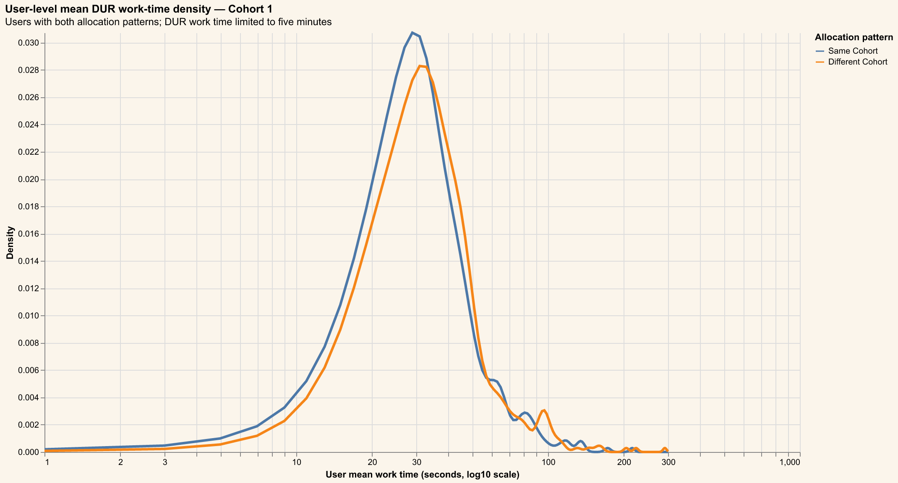
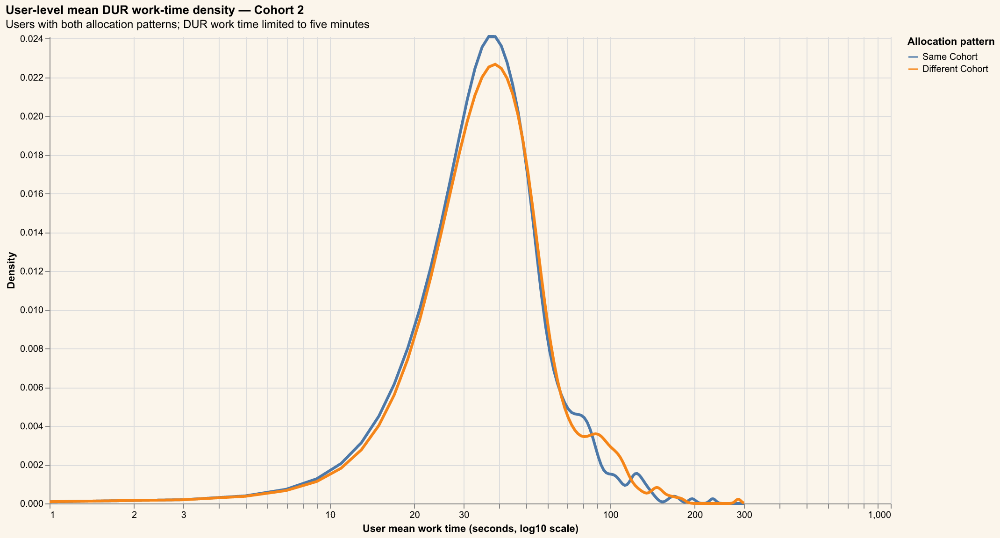
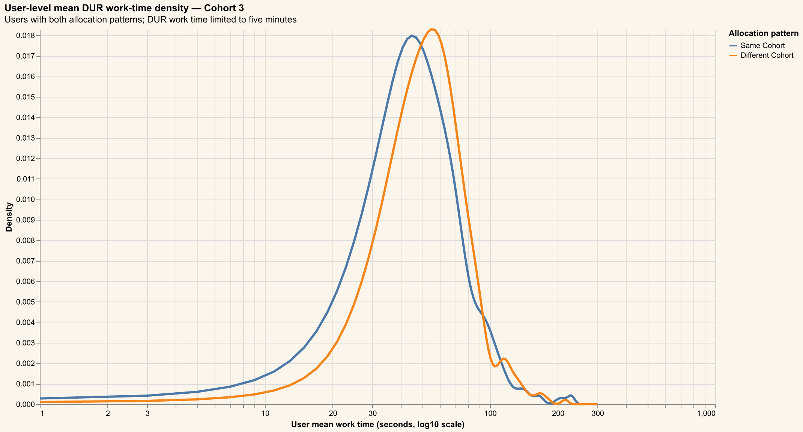
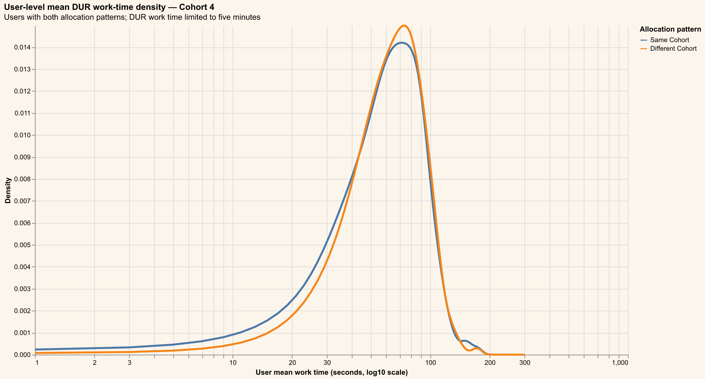

# Santhosh User-Level Analysis

## Purpose and method

This analysis compares Same Cohort and Different Cohort DUR work time within
users, separately for Cohorts 1–4. Task durations are first averaged within
each user, cohort, and allocation pattern. Only users with both allocation
patterns in the same cohort are retained, so the comparison is paired by user.

The paired test is a two-sided paired t-test on the within-user difference
**Same Cohort − Different Cohort**, with alpha = 0.05. The density plots show
the two distributions of user-level means on a base-10 logarithmic x-axis.

The source query keeps transitions on or after 2026-08-01, DUR tasks with final
status `CLOSED`, non-null user and start time, work time between 0.01 and 5
minutes, and known item cohorts. Rows without a previous cohort are excluded.

## Cohort 1



| Allocation pattern | Users | Mean user mean (min) | SD | Median | P25 | P75 |
|---|---:|---:|---:|---:|---:|---:|
| Same Cohort | 289 | 0.6681 | 0.4217 | 0.5410 | 0.4329 | 0.7469 |
| Different Cohort | 289 | 0.7308 | 0.5220 | 0.5909 | 0.4648 | 0.7776 |

The paired comparison uses the within-user difference
**Same Cohort − Different Cohort** for the 289 users who have
observations in both allocation patterns.

| Quantity | Result |
|---|---:|
| Mean paired difference (minutes) | -0.0626 |
| 95% CI for paired difference | [-0.0972, -0.0281] |
| Paired t-statistic | -3.5706 |
| Degrees of freedom | 288 |
| Two-sided p-value | 0.000417184 |

At the 0.05 level, we **reject** the null hypothesis for Cohort 1.

## Cohort 2



| Allocation pattern | Users | Mean user mean (min) | SD | Median | P25 | P75 |
|---|---:|---:|---:|---:|---:|---:|
| Same Cohort | 286 | 0.8402 | 0.4910 | 0.7114 | 0.5552 | 0.9312 |
| Different Cohort | 286 | 0.8767 | 0.5259 | 0.7445 | 0.5660 | 0.9848 |

The paired comparison uses the within-user difference
**Same Cohort − Different Cohort** for the 286 users who have
observations in both allocation patterns.

| Quantity | Result |
|---|---:|
| Mean paired difference (minutes) | -0.0365 |
| 95% CI for paired difference | [-0.0703, -0.0028] |
| Paired t-statistic | -2.1302 |
| Degrees of freedom | 285 |
| Two-sided p-value | 0.0340156 |

At the 0.05 level, we **reject** the null hypothesis for Cohort 2.

## Cohort 3



| Allocation pattern | Users | Mean user mean (min) | SD | Median | P25 | P75 |
|---|---:|---:|---:|---:|---:|---:|
| Same Cohort | 250 | 1.0091 | 0.5552 | 0.8809 | 0.6676 | 1.1693 |
| Different Cohort | 250 | 1.0650 | 0.4785 | 0.9695 | 0.7510 | 1.2296 |

The paired comparison uses the within-user difference
**Same Cohort − Different Cohort** for the 250 users who have
observations in both allocation patterns.

| Quantity | Result |
|---|---:|
| Mean paired difference (minutes) | -0.0559 |
| 95% CI for paired difference | [-0.1043, -0.0075] |
| Paired t-statistic | -2.2766 |
| Degrees of freedom | 249 |
| Two-sided p-value | 0.0236591 |

At the 0.05 level, we **reject** the null hypothesis for Cohort 3.

## Cohort 4



| Allocation pattern | Users | Mean user mean (min) | SD | Median | P25 | P75 |
|---|---:|---:|---:|---:|---:|---:|
| Same Cohort | 139 | 1.2037 | 0.4488 | 1.1814 | 0.9098 | 1.4688 |
| Different Cohort | 139 | 1.2202 | 0.4161 | 1.2020 | 0.9106 | 1.4989 |

The paired comparison uses the within-user difference
**Same Cohort − Different Cohort** for the 139 users who have
observations in both allocation patterns.

| Quantity | Result |
|---|---:|
| Mean paired difference (minutes) | -0.0164 |
| 95% CI for paired difference | [-0.0557, 0.0229] |
| Paired t-statistic | -0.8272 |
| Degrees of freedom | 138 |
| Two-sided p-value | 0.409542 |

At the 0.05 level, we **do not reject** the null hypothesis for Cohort 4.


## Limitations

The unit of inference is the user within cohort, not the individual task. Users
with only one allocation pattern are excluded from each paired comparison, and
the resulting estimates describe the matched-user population. The analysis is
observational and does not establish that cohort allocation causes a difference.

## Query used

```sql
WITH ordered AS (
  SELECT
    TASK_ID,
    USER_ID,
    ITEM_COHORT,
    STARTED_AT,
    TRANSITION_STARTED_AT::DATE AS dt,
    LAG(ITEM_COHORT) OVER (
      PARTITION BY USER_ID, TRANSITION_STARTED_AT::DATE
      ORDER BY STARTED_AT
    ) AS prev_cohort,
    DWELL_IN_PROGRESS_TO_CLOSED_MINUTES AS work_min
  FROM EDLDB.PET_HEALTH_ANALYTICS_SANDBOX.FCT__TASKS_LIFECYCLE
  WHERE TRANSITION_STARTED_AT >= '2026-08-01'
    AND TASK_TYPE = 'DUR'
    AND FINAL_STATUS = 'CLOSED'
    AND USER_ID IS NOT NULL
    AND STARTED_AT IS NOT NULL
    AND DWELL_IN_PROGRESS_TO_CLOSED_MINUTES BETWEEN 0.01 AND 5
    AND ITEM_COHORT != 'Unknown'
)
SELECT
  TASK_ID AS task_id,
  USER_ID AS user_id,
  dt,
  CASE
    WHEN ITEM_COHORT = prev_cohort THEN 'Same Cohort'
    ELSE 'Different Cohort'
  END AS allocation_pattern,
  ITEM_COHORT AS cohort,
  work_min
FROM ordered
WHERE prev_cohort IS NOT NULL
ORDER BY allocation_pattern, work_min
```
