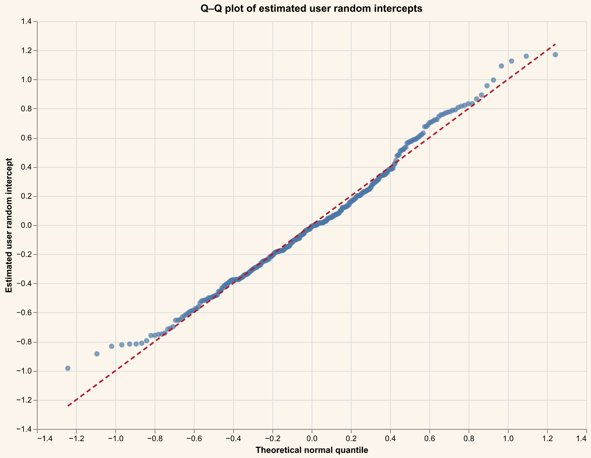
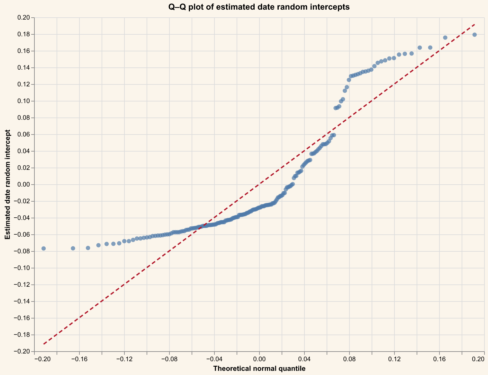
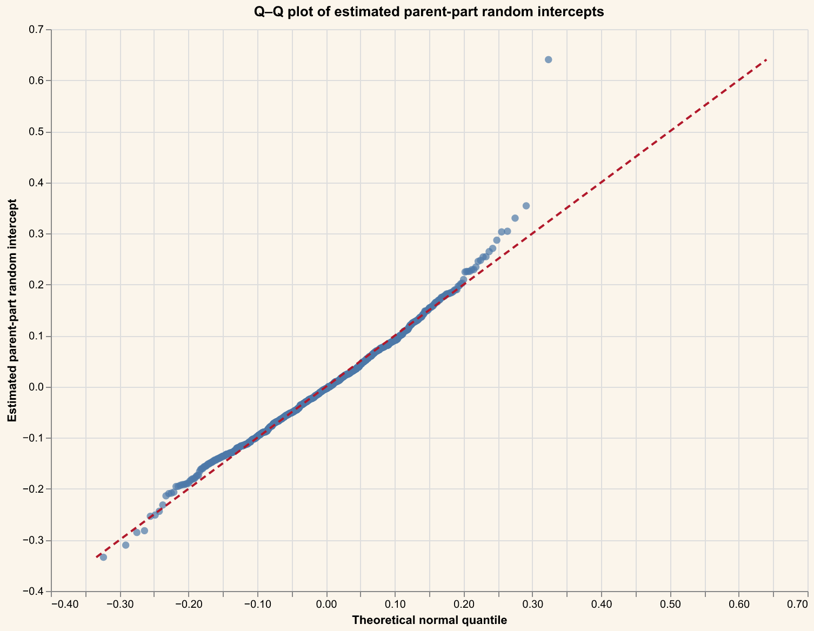
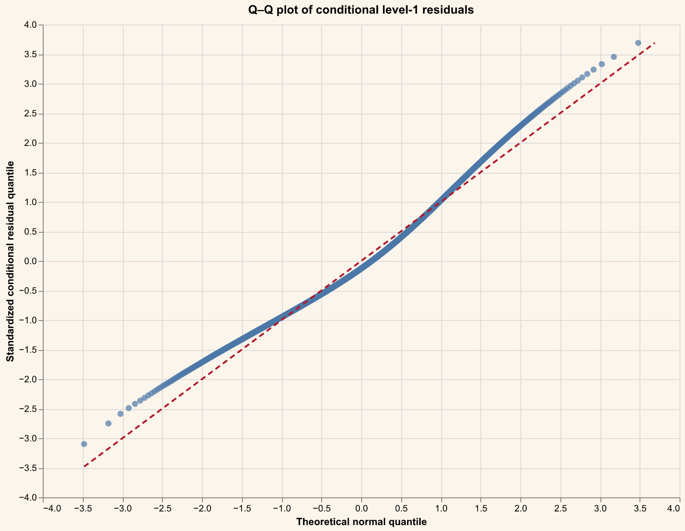
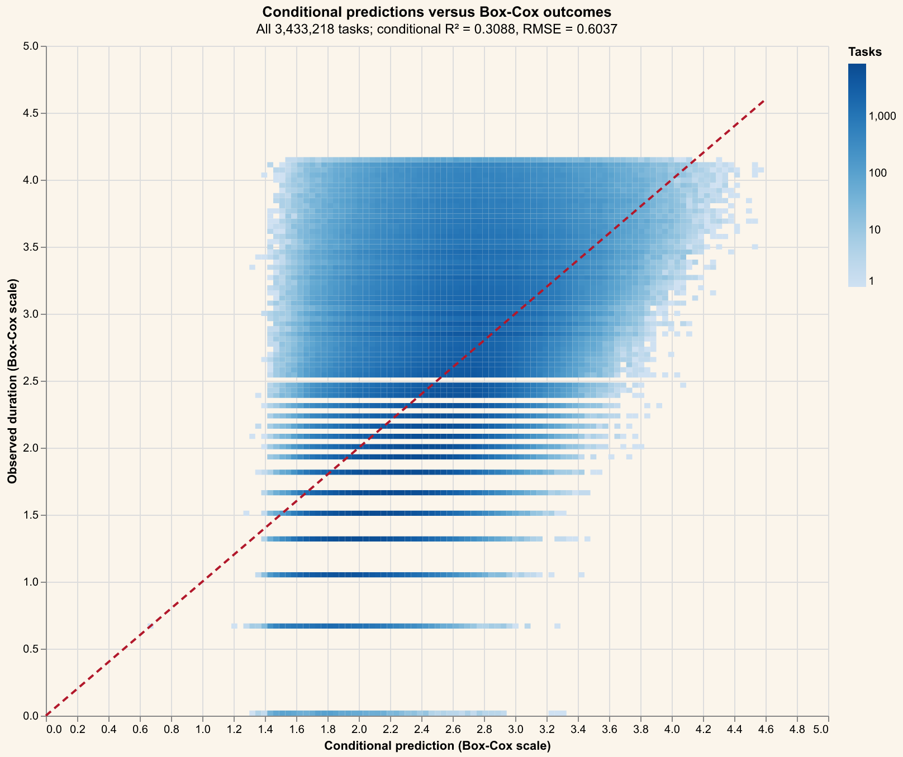

# Progress Report

## 2026-10-01

### Modeling DUR Processing Time

<!---USER-MANAGED-CONTEXT--->

A model was built to predict DUR durations for the following reasons:
- The analysis [Would Grouping Similar Work Make Pharmacists Faster? What the data says](https://chewyinc.atlassian.net/wiki/x/hYRyRQE) concludes that the previous task has no effect. We would like to know whether the result changes after controlling for factors other than MC3, cohort, or part number. We also want to determine whether another definition of similarity is more appropriate and quantify the uncertainty in the estimate.

Consider two task sequences from the same user:

| MC3          | SEQUENCE ORDER | PART_NUMBER | PET | DURATION | START TIME            | UPDATED FIELDS | APPROVAL CHANNEL | INITIATION CHANNEL |
| --- | ---: | ---: | --- | ---: | --- | --- | --- | --- |
| Parasiticide |            1 | 146066      | Dog     |                                          40 | 2026-04-30 06:42:54.000 +0000 |                                             | PH               | AUTOSHIP           |
| Parasiticide |            2 | 152702      | Dog     |                                          27 | 2026-04-30 06:43:36.000 +0000 | directions                                  | PH               | AUTOSHIP           |
| Parasiticide |            3 | 146391      | Dog     |                                          40 | 2026-04-30 06:44:06.000 +0000 |                                             | PH               | AUTOSHIP           |
| Parasiticide |            4 | 151583      | Dog     |                                           7 | 2026-04-30 06:44:48.000 +0000 |                                             | PH               | AUTOSHIP           |
| Parasiticide |            5 | 146138      | Dog     |                                           7 | 2026-04-30 06:44:56.000 +0000 |                                             | PH               | AUTOSHIP           |
| Parasiticide |            6 | 146142      | Dog     |                                          43 | 2026-04-30 06:45:05.000 +0000 | directions                                  | PH               | AUTOSHIP           |
| Parasiticide |            7 | 146142      | Dog     |                                          35 | 2026-04-30 06:45:49.000 +0000 | directions                                  | PH               | AUTOSHIP           |
| Parasiticide |            8 | 146064      | Dog     |                                          39 | 2026-04-30 06:46:26.000 +0000 | directions                                  | PH               | AUTOSHIP           |
| Parasiticide |            9 | 146167      | Dog     |                                          12 | 2026-04-30 06:47:07.000 +0000 |                                             | PH               | AUTOSHIP           |
| Parasiticide |           10 | 146322      | Dog     |                                           9 | 2026-04-30 06:47:21.000 +0000 | directions                                  | PH               | AUTOSHIP           |
| Parasiticide |           11 | 146167      | Dog     |                                          97 | 2026-04-30 06:47:32.000 +0000 | directions                                  | PH               | AUTOSHIP           |
| Parasiticide |           12 | 146050      | Dog     |                                           6 | 2026-04-30 06:49:11.000 +0000 |                                             | PH               | AUTOSHIP           |
| Parasiticide |           13 | 146387      | Dog     |                                          54 | 2026-04-30 06:49:19.000 +0000 |                                             | PH               | AUTOSHIP           |

and

| MC3          | SEQUENCE ORDER | PART_NUMBER | PET | DURATION | START TIME            | UPDATED FIELDS | APPROVAL CHANNEL | INITIATION CHANNEL |
| --- | ---: | ---: | --- | ---: | --- | --- | --- | --- |
| Parasiticide |            1 | 158995      | Cat     |                                          11 | 2026-07-15 02:17:23.000 +0000 |                      | PH               | OMS                |
| Parasiticide |            2 | 158995      | Cat     |                                          35 | 2026-07-15 02:17:36.000 +0000 |                      | PH               | OMS                |
| Parasiticide |            3 | 158995      | Cat     |                                           3 | 2026-07-15 02:18:13.000 +0000 |                      | PH               | OMS                |
| Parasiticide |            4 | 158995      | Cat     |                                          13 | 2026-07-15 02:18:17.000 +0000 |                      | PH               | OMS                |
| Parasiticide |            5 | 158995      | Cat     |                                          13 | 2026-07-15 02:18:31.000 +0000 |                      | PH               | OMS                |
| Parasiticide |            6 | 158995      | Cat     |                                           6 | 2026-07-15 02:18:46.000 +0000 |                      | PH               | OMS                |
| Parasiticide |            7 | 158995      | Cat     |                                          16 | 2026-07-15 02:18:53.000 +0000 |                      | PH               | OMS                |
| Parasiticide |            8 | 158995      | Cat     |                                          13 | 2026-07-15 02:19:11.000 +0000 |                      | PH               | OMS                |
| Parasiticide |            9 | 158995      | Cat     |                                           6 | 2026-07-15 02:19:25.000 +0000 |                     | PH               | OMS                |
| Parasiticide |           10 | 158995      | Cat     |                                          50 | 2026-07-15 02:19:32.000 +0000 |                      | PH               | OMS                |
| Parasiticide |           11 | 158998      | Cat     |                                          11 | 2026-07-15 02:20:23.000 +0000 |                      | PH               | OMS                |
| Parasiticide |           12 | 158998      | Cat     |                                          29 | 2026-07-15 02:20:36.000 +0000 |                      | PH               | OMS                |

The second sequence demonstrates substantial inherent variability in
DUR times. Using a model, we would like to quantify this variability.

- Another motivation is to simulate what-if scenarios in which different
  users perform a task. The model could estimate DUR times for task-user
  combinations that were not observed historically, with associated
  uncertainty bounds.

The model predicts a statistically significant effect when the preceding
task is "similar" for a user. However, substantial unexplained variation
remains.

The predicted effect at several baseline DUR durations is:

| Duration without same preceding task | Duration with same preceding task | -1 residual SD bound | +1 residual SD bound | Difference | Percentage change |
| ---: | ---: | ---: | ---: | ---: | ---: |
| 15.00 s | 14.16 s | 6.84 s | 30.70 s | -0.84 s | -5.58% |
| 50.00 s | 46.93 s | 21.09 s | 110.44 s | -3.07 s | -6.14% |
| 150.00 s | 139.96 s | 58.53 s | 357.84 s | -10.04 s | -6.69% |

The model predicts that users and products differ in processing speed,
while day of the week has no statistically significant effect.

The model also predicts longer DUR times when prescription data are
altered.

<!---USER-MANAGED-CONTEXT--->

How reliable are our estimates for hypothetical sequencing scenarios?

### EDA on Factors Affecting DUR

See [Factors Affecting DUR](#factors-affecting-successful-durs) in the Appendix.

<!---USER-MANAGED-CONTEXT--->

We assume that the following groups of factors affect DUR duration:

1. The user
   - Are some users inherently slower? Are they consistently slower or faster across cohorts?
2. The prescription
   - Medication
   - Content (typos, missing information)
   - Pet
     - Pet health history
3. Business process
4. Outside disturbances, such as inbound calls
5. The user's task history
   - Did they perform similar tasks previously?
6. Environment
7. Software platform

A more detailed breakdown can be found [here](../outputs/charts/DUR_detailed.png).
<!---USER-MANAGED-CONTEXT--->

For details, see [Model Details](#model-details) in the Appendix.

### Appendix

#### Model Details

##### Final MC3/COH/PETTYPE mixed-effects model

<!--USER-MANAGED-CONTENT-->

The model is built to understand the factors affecting approved DUR task durations.
It uses MC3, cohort, and pet type to define groups of similar DUR tasks.

The model controls for weekday, approval channel, prescription source, parent part number, user (for example, pharmacist or pharmacy technician), and changes to prescription data, such as updated directions.

There are two treatments based on whether the current task is adjacent to another task in the same MC3, cohort, and pet type equivalence class for a given user. Adjacent tasks must be no more than one hour apart. Failed DURs and DUR tasks that overlap in time with other DUR tasks are excluded; these cases occur for certain orders. If a preceding task belongs to the same equivalence class, the `SAME_PRECEDING` treatment is true. If the following task belongs to the same equivalence class, the `SAME_FOLLOWING` treatment is true. `SAME_FOLLOWING` is expected to have a coefficient near zero. It exists to check whether the model captures confounding factors adequately.

The model estimates each user's deviation from mean performance.
It does the same for each parent part number and each calendar date.

The model predicts that, for a given user, a task preceded by a task in the same cell has a shorter DUR duration. After controlling for MC3, cohort, pet type, and parent part number, the model finds no statistically significant association with `SAME_FOLLOWING`.

The weekday fixed effects are not statistically significant, whereas some
approval-channel and prescription-source effects are. Customer-originated
prescriptions take longer.

<!--USER-MANAGED-CONTENT-->

###### Purpose and analysis sample

This is the final model. It estimates how same-cell sequence position relates
to DUR duration while controlling for correction status, weekday, approval
channel, prescription source, and MC3/COH/PETTYPE cell. It includes crossed
random intercepts for user, process date, and parent part number.

The source is `EDLDB_DEV.PET_HEALTH_ANALYTICS_SANDBOX.MY_RXP_VALID_DUR_TASKS`. Eligible rows have non-null user, task,
process-start time, `MC3_COH_PETTYPE_SEQN`, and
`MC3_COH_PETTYPE_BATCH_LEN`; sequence and batch length are at least one, and
sequence does not exceed batch length. Duration is
`IMPUTED_DWELL_IN_PROGRESS_TO_CLOSED_SECONDS`.

Let $Y_i$ be the positive imputed duration in seconds for task $i$. One
global cutoff is calculated over all otherwise eligible tasks with Snowflake's
`APPROX_PERCENTILE(Y, 0.95)` function call:

$$
q_{0.95}=Q_{0.95}(Y).
$$

The fitted sample keeps tasks satisfying $0<Y_i<q_{0.95}$; the upper
bound is strict. MC3, COH, PETTYPE, parent part number, approval channel, and
prescription source blanks are represented by `<Missing>`.

###### Derived indicators

For sequence number $S_i$, batch length $L_i$, and correction count
$N_i$, the three binary fixed effects are

$$
P_i=\mathbf{1}(L_i>1\ \land\ S_i>1),
\qquad
F_i=\mathbf{1}(L_i>1\ \land\ S_i<L_i),
\qquad
C_i=\mathbf{1}(N_i>0).
$$

Thus $P_i$ is `SAME_PRECEDING`, $F_i$ is `SAME_FOLLOWING`, and $C_i$
is `HAS_CORRECTION`.

###### Outcome transformation

The retained durations receive one global Box-Cox transformation:

$$
Z_i=g_\lambda(Y_i)=
\begin{cases}
\dfrac{Y_i^\lambda-1}{\lambda}, & \lambda\ne0,\\
\log(Y_i), & \lambda=0.
\end{cases}
$$

The maximum-likelihood transformation estimate is
$\widehat{\lambda}=-0.08159843$. All coefficients, random
effects, standard deviations, residuals, RMSE, and diagnostics are therefore
on the Box-Cox scale.

###### Complete model formula

Index task, fixed-effect cell, user, date, and parent part by $i, c, u, d, p$.
The model is

$$
\begin{aligned}
Z_i={}&\gamma_{c(i)}+\beta_P P_i+\beta_F F_i+\beta_C C_i\\
&+\sum_{w\ne\mathrm{Sun}}\delta_w\mathbf{1}(W_i=w)\\
&+\sum_{a\ne a_0}\theta_a\mathbf{1}(A_i=a)
+\sum_{s\ne s_0}\phi_s\mathbf{1}(R_i=s)\\
&+b_{u(i)}+h_{d(i)}+r_{p(i)}+\epsilon_i.
\end{aligned}
$$

Here $\gamma_{c(i)}$ is a fixed effect shared by all tasks in the same
MC3 + COH + PETTYPE cell. The model uses a full set of cell effects and no
separate overall intercept. Sunday is the weekday reference. The
data-dependent categorical references are:

- approval channel $a_0$: `PH`
- prescription source $s_0$: `PRACTICE_HUB`

Each reference is the most frequent retained level; lexicographic order breaks
a frequency tie. The crossed random terms and level-1 error are mutually
independent and satisfy

$$
b_u\sim N(0,\sigma_u^2),\qquad
h_d\sim N(0,\sigma_d^2),\qquad
r_p\sim N(0,\sigma_p^2),\qquad
\epsilon_i\sim N(0,\sigma_e^2).
$$

The fixed effects and variance components are estimated jointly by REML. The
conditional fitted value and residual are

$$
\widehat{Z}_i=\widehat{\gamma}_{c(i)}+x_i^T\widehat{\beta}
+\widehat{b}_{u(i)}+\widehat{h}_{d(i)}+\widehat{r}_{p(i)},
\qquad e_i=Z_i-\widehat{Z}_i.
$$

###### Inference and fit statistics

For fixed effect $k$, the report uses

$$
z_k=\frac{\widehat{\beta}_k}{\mathrm{SE}(\widehat{\beta}_k)},\qquad
p_k=2\Phi(-\lvert z_k\rvert),\qquad
\mathrm{CI}_{95}=\widehat{\beta}_k\pm1.96\,\mathrm{SE}(\widehat{\beta}_k).
$$

The fixed-effect table labels an estimate `Significant = Yes` when its 95%
confidence interval excludes zero; intervals that cross or touch zero are
marked `No`.

Random-effect SD intervals use an observed-information Wald approximation on
the log-SD scale. The residual-SD interval uses the chi-square distribution.
The reported conditional metrics include all fixed and random effects:

$$
R_c^2=1-\frac{\sum_i e_i^2}{\sum_i(Z_i-\bar Z)^2},\qquad
RMSE_c=\sqrt{\frac1n\sum_i e_i^2}.
$$

###### Sample and fit

| Quantity | Value |
|---|---:|
| Tasks | 3,433,218 |
| MC3/COH/PETTYPE cells | 265 |
| Users | 340 |
| Dates | 182 |
| Parent part numbers | 885 |
| Approval-channel levels | 9 |
| Prescription-source levels | 11 |
| Global approximate P95 cutoff (seconds) | 156.598673 |
| Box-Cox lambda | -0.08159843 |
| Conditional R-squared | 0.308784 |
| Conditional RMSE (Box-Cox scale) | 0.603674 |
| REML negative log-likelihood | 3142827.127402 |
| Converged | True |

###### Fixed effects

| Term | Estimate | SE | z | p-value | 95% CI | Significant |
|---|---:|---:|---:|---:|---:|:---:|
| SAME_PRECEDING | -0.046157 | 0.000835 | -55.2813 | <1e-300 | [-0.047793, -0.044520] | Yes |
| SAME_FOLLOWING | 0.001024 | 0.000835 | 1.2259 | 0.220231 | [-0.000613, 0.002661] | No |
| HAS_CORRECTION | 0.271146 | 0.000788 | 344.0672 | <1e-300 | [0.269601, 0.272690] | Yes |
| WEEKDAY_MON | 0.006416 | 0.019649 | 0.3265 | 0.74404 | [-0.032096, 0.044927] | No |
| WEEKDAY_TUE | 0.014299 | 0.019646 | 0.7278 | 0.466718 | [-0.024206, 0.052803] | No |
| WEEKDAY_WED | 0.010462 | 0.019650 | 0.5324 | 0.59444 | [-0.028051, 0.048975] | No |
| WEEKDAY_THU | 0.008138 | 0.019652 | 0.4141 | 0.678785 | [-0.030379, 0.046655] | No |
| WEEKDAY_FRI | 0.006015 | 0.019651 | 0.3061 | 0.75952 | [-0.032499, 0.044530] | No |
| WEEKDAY_SAT | 0.002131 | 0.019666 | 0.1084 | 0.913702 | [-0.036413, 0.040675] | No |
| APPROVAL_CHANNEL[CLINIC_EMAIL vs PH] | 0.235910 | 0.045211 | 5.2180 | 1.80853e-07 | [0.147299, 0.324522] | Yes |
| APPROVAL_CHANNEL[CUSTOMER_MAIL vs PH] | 0.472534 | 0.013061 | 36.1785 | 1.32431e-286 | [0.446934, 0.498133] | Yes |
| APPROVAL_CHANNEL[DIGITAL vs PH] | 0.146802 | 0.040724 | 3.6048 | 0.000312369 | [0.066985, 0.226619] | Yes |
| APPROVAL_CHANNEL[FAX vs PH] | 0.208015 | 0.011227 | 18.5276 | 1.23668e-76 | [0.186010, 0.230020] | Yes |
| APPROVAL_CHANNEL[PARTNER vs PH] | -0.034275 | 0.007967 | -4.3018 | 1.69381e-05 | [-0.049891, -0.018659] | Yes |
| APPROVAL_CHANNEL[RHAPSODY vs PH] | 0.075320 | 0.052573 | 1.4327 | 0.15195 | [-0.027721, 0.178362] | No |
| APPROVAL_CHANNEL[VERBAL vs PH] | -0.017687 | 0.010665 | -1.6585 | 0.097222 | [-0.038589, 0.003215] | No |
| APPROVAL_CHANNEL[VET vs PH] | 0.003570 | 0.105720 | 0.0338 | 0.973059 | [-0.203638, 0.210779] | No |
| PRESCRIPTION_SOURCE[CLINIC_EMAIL vs PRACTICE_HUB] | -0.003227 | 0.011181 | -0.2886 | 0.772878 | [-0.025141, 0.018687] | No |
| PRESCRIPTION_SOURCE[CS_FIRST_CONTACT vs PRACTICE_HUB] | -0.086051 | 0.203897 | -0.4220 | 0.673003 | [-0.485682, 0.313580] | No |
| PRESCRIPTION_SOURCE[CUSTOMER_MAIL vs PRACTICE_HUB] | 0.044423 | 0.012813 | 3.4672 | 0.000525987 | [0.019311, 0.069536] | Yes |
| PRESCRIPTION_SOURCE[CVC vs PRACTICE_HUB] | 0.023167 | 0.052511 | 0.4412 | 0.659085 | [-0.079753, 0.126087] | No |
| PRESCRIPTION_SOURCE[DIGITAL vs PRACTICE_HUB] | 0.020414 | 0.040106 | 0.5090 | 0.610753 | [-0.058192, 0.099020] | No |
| PRESCRIPTION_SOURCE[FAX vs PRACTICE_HUB] | -0.004739 | 0.011224 | -0.4222 | 0.67286 | [-0.026738, 0.017260] | No |
| PRESCRIPTION_SOURCE[PARTNER_API vs PRACTICE_HUB] | 0.018961 | 0.007944 | 2.3869 | 0.0169906 | [0.003392, 0.034530] | Yes |
| PRESCRIPTION_SOURCE[RHAPSODY vs PRACTICE_HUB] | -0.029700 | 0.062733 | -0.4734 | 0.6359 | [-0.152655, 0.093254] | No |
| PRESCRIPTION_SOURCE[TELEMEDICINE vs PRACTICE_HUB] | 0.185396 | 0.052942 | 3.5018 | 0.000462051 | [0.081631, 0.289161] | Yes |
| PRESCRIPTION_SOURCE[VERBAL vs PRACTICE_HUB] | -0.002803 | 0.011736 | -0.2388 | 0.81126 | [-0.025805, 0.020200] | No |

###### Variance components

| Component | SD | Approximate 95% CI |
|---|---:|---:|
| User random intercept | 0.422318 | [0.390500, 0.456728] |
| Date random intercept | 0.070610 | [0.063513, 0.078500] |
| Parent-part random intercept | 0.114187 | [0.107719, 0.121045] |
| Residual | 0.603803 | [0.603351, 0.604255] |

###### Diagnostics

###### Artifacts

- [Generated SQL](../generated/mc3_coh_pettype_final_model.sql)
- [Raw Snowflake data](../outputs/data/mc3_coh_pettype_final_model_task_data.parquet)
- [Transformed model data](../outputs/data/mc3_coh_pettype_final_model_boxcox_data.parquet)
- [Fixed-effect table](../outputs/tables/mc3_coh_pettype_final_model_fixed_effects.md)
- [User random effects](../outputs/tables/mc3_coh_pettype_final_model_user_effects.md)
- [Date random effects](../outputs/tables/mc3_coh_pettype_final_model_date_effects.md)
- [Parent-part random effects](../outputs/tables/mc3_coh_pettype_final_model_parent_part_effects.md)

#### Factors Affecting Successful DURs

[DUR detailed diagram](../outputs/charts/DUR_detailed.png)

##### User Performance

- User performance is correlated across all four cohorts. [View the user-performance scatter matrix](../outputs/charts/user-performance-analysis/user-performance-median-all-cohorts-scatter-matrix.png).
- User performance varies across cohorts. [View the user median DUR-duration distributions](../outputs/charts/user-performance-analysis/user-median-dur-duration-distributions.png).
- DUR processing time differs by job title. [View task duration by job title across all cohorts](../outputs/charts/tasks-based-distributions/task-duration-by-job-title-all-cohorts-boxplots.png).

##### Edits on Prescriptions

DUR processing time tends to increase with the number of prescription edits.

- [View the Cohort 1 correction-field analysis](../outputs/charts/ncorrection-fields-analysis/ncorrection-fields-analysis-cohort-1.png)
- [View the Cohort 2 correction-field analysis](../outputs/charts/ncorrection-fields-analysis/ncorrection-fields-analysis-cohort-2.png)
- [View the Cohort 3 correction-field analysis](../outputs/charts/ncorrection-fields-analysis/ncorrection-fields-analysis-cohort-3.png)
- [View the Cohort 4 correction-field analysis](../outputs/charts/ncorrection-fields-analysis/ncorrection-fields-analysis-cohort-4.png)

##### Pet Types Matter

- [View the Cohort 1 pet-type analysis](../outputs/charts/pettype-analysis/pettype-analysis-cohort-1.png)
- [View the Cohort 2 pet-type analysis](../outputs/charts/pettype-analysis/pettype-analysis-cohort-2.png)
- [View the Cohort 3 pet-type analysis](../outputs/charts/pettype-analysis/pettype-analysis-cohort-3.png)
- [View the Cohort 4 pet-type analysis](../outputs/charts/pettype-analysis/pettype-analysis-cohort-4.png)

##### Prescription Source

- [View the Cohort 1 prescription-source analysis](../outputs/charts/prescription-source-analysis/prescription-source-analysis-cohort-1.png)
- [View the Cohort 2 prescription-source analysis](../outputs/charts/prescription-source-analysis/prescription-source-analysis-cohort-2.png)
- [View the Cohort 3 prescription-source analysis](../outputs/charts/prescription-source-analysis/prescription-source-analysis-cohort-3.png)
- [View the Cohort 4 prescription-source analysis](../outputs/charts/prescription-source-analysis/prescription-source-analysis-cohort-4.png)

##### Approval Channel

- [View the Cohort 1 approval-channel analysis](../outputs/charts/approval-channel-analysis/approval-channel-analysis-cohort-1.png)
- [View the Cohort 2 approval-channel analysis](../outputs/charts/approval-channel-analysis/approval-channel-analysis-cohort-2.png)
- [View the Cohort 3 approval-channel analysis](../outputs/charts/approval-channel-analysis/approval-channel-analysis-cohort-3.png)
- [View the Cohort 4 approval-channel analysis](../outputs/charts/approval-channel-analysis/approval-channel-analysis-cohort-4.png)

#### Cohort Descriptions

<!--USER-MANAGED-CONTENT-->

- Cohort 1: Boxed parasiticides. This was the best starting point because it represents roughly 40% of total DUR volume and the majority of the initial digital volume, while the clinical rules are relatively standardized and label-driven. The primary checks are species, weight range, monthly directions, days' supply, duplicate parasite coverage, and known contraindications. This gave us a high-volume population with relatively low variability for validating the core RxBuddy and DUR Copilot experience.

- Cohort 2: Non-controlled, non-boxed medications. This represents roughly 29% of total DUR volume and materially expands coverage, but the clinical review is more complex. These medications require generalized dosing evaluation, including strength, dose, frequency, route, indication, species appropriateness, duplicate therapy, contraindications, and potential interactions. We separated this cohort so those broader AI checks could be validated without also introducing compounding or controlled-substance requirements at the same time.

- Cohort 3: Non-controlled compounded medications. This is a smaller segment at roughly 4.4% of DUR volume, but it has distinct clinical and compliance requirements. Compounds require a documented compounding reason, formulation-specific directions, and validation that the prescribed days' supply does not exceed the product's beyond-use date. BUD rules vary by dosage form, storage conditions, formulation, and stability-study results. Keeping compounds separate allowed us to test these specialized workflows and manage their impact on pharmacist throughput independently.

- Cohort 4: Gabapentin and the high-scrutiny regulatory workflow. This represents roughly 1.1% of DUR volume. The implemented Phase 4 scope focused on uncontrolled gabapentin rather than the full controlled-substance population, but it was separated because it introduces site eligibility, pharmacist skill gating, regulatory indicators, mixed-order handling, and state-specific scrutiny. It also gave us a contained way to validate infrastructure that will be needed for broader controlled-substance support later.
<!--USER-MANAGED-CONTENT-->
